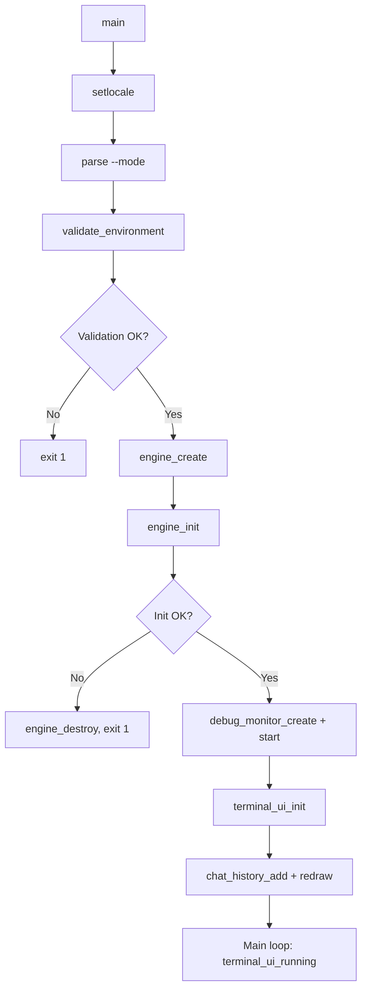
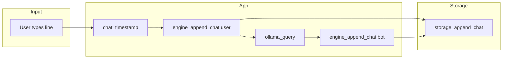
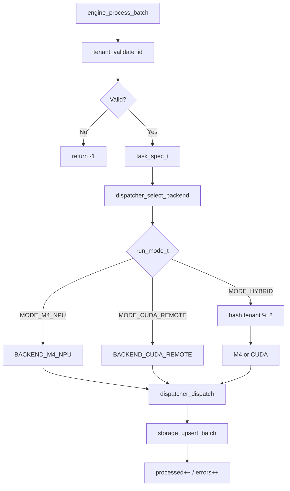
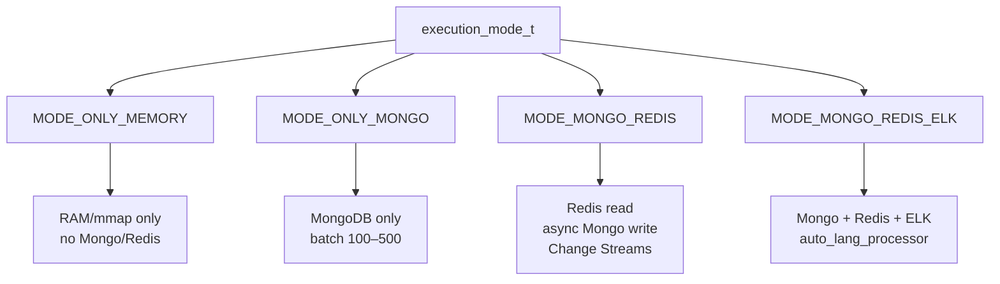
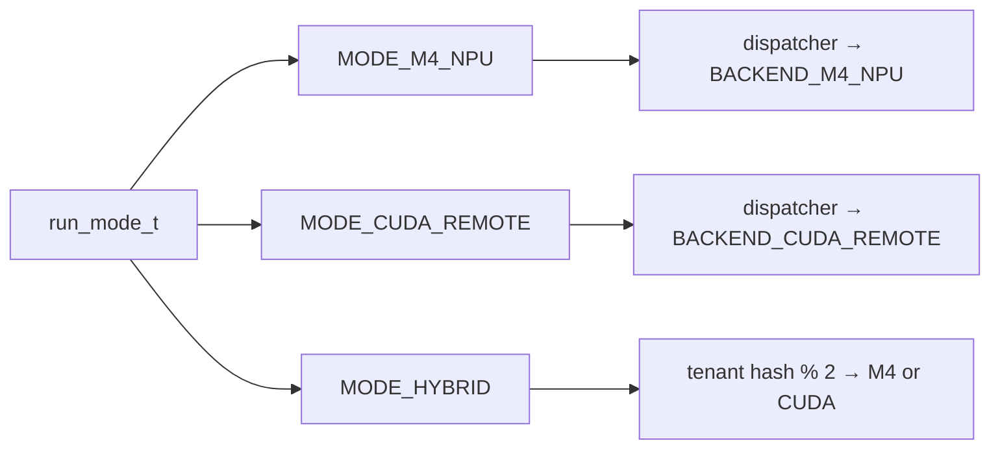
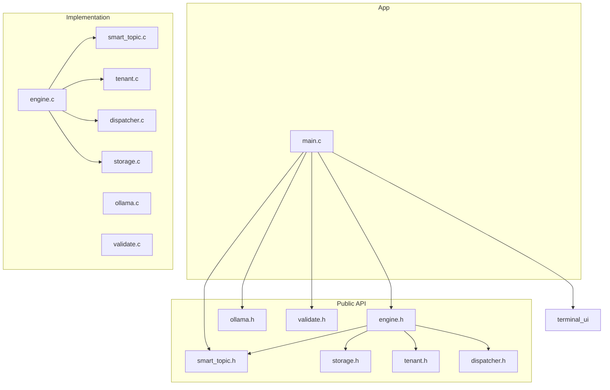
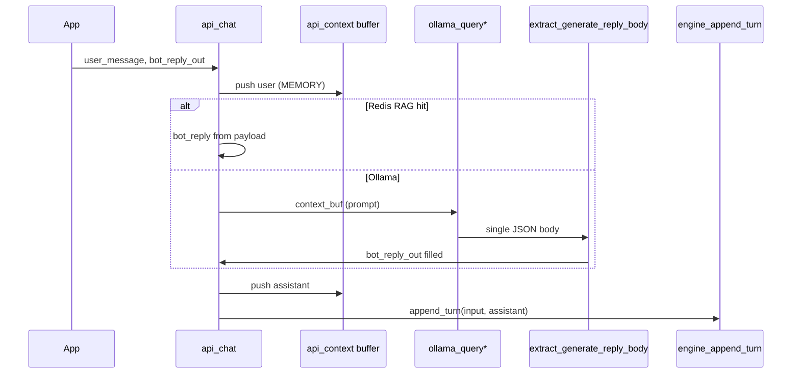
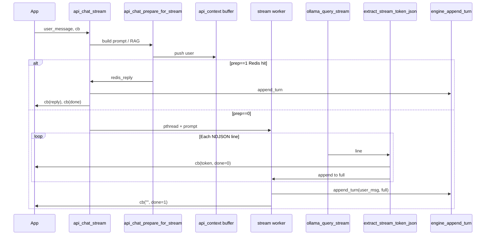

# M4-Hardcore AI Engine — Flow Design

This document describes the control and data flows of the c-lib (C library) and the terminal app (ai_bot) that uses it.

---

## 1. Application boot flow

Boot sequence as implemented in `main.c`: validate environment → create engine → init storage → start debug monitor and terminal UI → enter main loop.

**Steps:**

| Step | Action |
|------|--------|
| 1 | `validate_environment(&config)` — checks Redis, ELK; optional connectivity (rule.md). |
| 2 | `engine_create(&config)` — allocates engine, creates `storage_ctx_t` (Mongo/Redis/ES). |
| 3 | `engine_init(engine)` — `storage_connect()`; if `config.smart_topic_opts` is set and enabled, calls **initial_smart_topic()** (see [smart_topic.md](smart_topic.md)). |
| 4 | Debug monitor and ncurses terminal UI start; main loop runs until user quits. |

---

## 2. Chat flow (user message → Ollama → persistence)

When the user submits a line in the terminal, the app gets a bot reply via Ollama and persists both user and bot messages through the engine.

**Sequence:**

1. User submits line → `chat_timestamp()` for user message.
2. `engine_append_chat(engine, "default", "user", line, user_ts)` → in non–ONLY_MEMORY modes calls `storage_append_chat()` (MongoDB chat collection).
3. **If smart_topic enabled:** `get_smart_topic()` → `smart_topic_temperature_for_query(line, &temp)` (micro-query: TECH→0.0, CHAT→0.8, DEFAULT→0.5) → `ollama_query_with_options(..., temp, ...)`. **Else:** `ollama_query(...)`.
4. Bot response written to chat history and `engine_append_chat(engine, "default", "bot", buf, tmbuf)` → again `storage_append_chat()` when not ONLY_MEMORY.

Ollama is invoked from a worker thread; the UI shows “thinking” until the thread signals done. See [smart_topic.md](smart_topic.md).

---

## 3. Batch processing flow (engine_process_batch)

Used for bulk records (e.g. “simulate batch” with `s` in terminal, or when c_ai/python_ai send batches). Tenant is validated, then dispatcher selects backend and storage upserts.

**Steps:**

| Step | Component | Action |
|------|-----------|--------|
| 1 | `engine.c` | Validate `tenant_id` via `tenant_validate_id()`. |
| 2 | `dispatcher` | Build `task_spec_t`; `dispatcher_select_backend(mode, &spec)` — M4 only, CUDA only, or hybrid (tenant hash % 2). |
| 3 | `dispatcher` | `dispatcher_dispatch(backend, &spec)` — currently stubbed (M4 enqueue / remote CUDA TODO). |
| 4 | `engine.c` | `storage_upsert_batch(storage, tenant_id, records, count)` — MongoDB bulk upsert. |
| 5 | `engine.c` | Update `processed` or `errors` counters. |

---

## 4. Execution modes (storage path)

Execution mode (`execution_mode_t`) decides whether chat and data hit external systems (rule §7).

- **A — ONLY_MEMORY:** `engine_append_chat` is a no-op (no DB); batch path can still use in-memory handling.
- **B — ONLY_MONGO:** MongoDB only; batch via `mongoc_bulk_operation_t`.
- **C — MONGO_REDIS:** Redis for reads, async Mongo writes, Change Streams sync.
- **D — MONGO_REDIS_ELK:** Adds Elasticsearch with `pipeline=auto_lang_processor` for localization.

---

## 5. Run modes (compute backend)

Run mode (`run_mode_t`) selects where inference runs: M4 NPU, remote CUDA, or hybrid.

- **m4 / npu:** All work dispatched to M4 NPU (stub: TODO enqueue).
- **cuda / remote:** All work dispatched to remote CUDA (stub: TODO send).
- **hybrid:** Round-robin by tenant hash between M4 and CUDA.

---

## 6. Component dependency overview

High-level dependency between public API and internals.

---

## 7. Cache before MongoDB (current behavior)

**Do we fetch/cache information before getting information from MongoDB?**

- **Yes, for chat history.** When Redis is connected, `api_load_chat_history(ctx, tenant_id, user_id)` uses **cache-first**: `storage_get_chat_history_cached()` tries L1 key `m4:cache:history:{tenant_id}` (tenant-wide) or `m4:cache:history:{tenant_id}:{user_id}` when `user_id` is set; on **miss**, Mongo is queried with **both** `tenant_id` and optional `user` filter, then Redis is populated (TTL **300** s, `REDIS_CACHE_TTL_SECONDS` in `include/redis.h`).
- **TTL:** L1 cache keys use **300 seconds** (5 minutes) when set. The constant `REDIS_CACHE_TTL_SECONDS` is in `redis.h`; the stub `redis_set_value` accepts `ttl_seconds` but does not apply it until a real Hiredis impl uses SETEX.
- **Per-message flow:** In `api_chat` we do **not** read from Mongo in the hot path. Context comes from in-memory buffer + optional RAG (Redis L2).
- **Reply caching:** The “L1 → L2 → Ollama” path for **reply** cache (avoid calling Ollama when L1/L2 has a hit) is **not implemented**: we always call Ollama. Cache is in place for **history** (check before Mongo); reply cache would be a separate step (check L1/L2 before `ollama_query`).

---

## 8. What is compiled into the prompt

The string sent to Ollama (`context_buf` in `api_chat`) is built in this **order** (see `api.c`: RAG prepend, then `ctx_build_prompt`):

| Order | Block | Content |
|-------|--------|--------|
| 1 | **RAG context** (optional) | Only when Redis L2 is connected and vector search enabled. Prepended as: `"Context from past turns:\n"` + up to 5 semantic-search snippets (from `storage_rag_search`) + `"\n\n"`. |
| 2 | **Topic** | `"Topic: "` + (current user message truncated to ~240 chars, or `"General"`) + `"\n\n"`. |
| 3 | **System guard** | `"Maintain the persona of a C Systems Engineer based on the provided history.\n\n"`. |
| 4 | **Last N messages** | Rule §12: last **5** messages from the in-memory circular buffer, each as `"User: "` or `"Assistant: "` + content + `"\n"`. |

So the **prompt** = `[RAG block if any]` + `Topic: ...` + system guard + last 5 user/assistant turns. Total size is bounded by `API_CONTEXT_BUFFER_SIZE` (64 KB); RAG prefix by `API_RAG_PREFIX_MAX` (4 KB).

---

## 9. SEQUENCE INPUT DATA

How **user text** enters the stack and how **assistant text** is **extracted** from Ollama for persistence (`engine_append_turn` → Mongo `turn.input` / `turn.assistant`). Two API shapes:

| Case | API | Ollama call | Where reply text is extracted |
|------|-----|-------------|------------------------------|
| **A — No stream** | `api_chat` | `POST /api/generate` with `"stream":false` | One HTTP body → `extract_generate_reply_body()` in `ollama.c` |
| **B — Stream** | `api_chat_stream` | `POST /api/generate` with `"stream":true` | Each NDJSON line → `extract_stream_token_json()`; fragments concatenated into `full` |

---

### 9.1 Case 1 — Without stream (`api_chat`)

**Input path (user text)**

1. Caller passes **`user_message`** and output buffer **`bot_reply_out`** / **`out_size`**.
2. **`epoch_ms_string`** → `user_ts` (epoch ms string for the turn).
3. **`ctx_push_message_with_source(ctx, "user", msg, API_SOURCE_MEMORY, user_ts)`** — user line enters the in-memory circular buffer (used for the next prompt’s “last N” turns).
4. Optional **Redis RAG** (when vector search enabled + Redis up): **`ollama_embeddings`** on `msg` → **`storage_rag_search`** → if top hit **`score ≥ API_RAG_REPLY_MIN_SCORE`**, reply text is taken from the hit payload (**assistant** = substring after the first `\n` in `input\nassistant` form), copied into **`bot_reply_out`**, then flow jumps to **`append_turn`** (skip Ollama).
5. Otherwise: **`ctx_build_prompt`** builds **`context_buf`** from history (+ optional RAG snippets prepended). **`api_apply_model_switch`** may change model / temperature / inject lane context into **`context_buf`**.

**Extract assistant text (non-stream)**

6. **`ollama_query`** or **`ollama_query_with_options`** sends **`context_buf`** to Ollama; the entire response body is buffered once.
7. **`extract_generate_reply_body(body, bot_reply_out, out_size)`** scans the JSON **in order** until a non-empty string is found:
   - `"response":"…"`
   - `"content":"…"` (chat-shaped or top-level)
   - after `"delta"`, nested `"content":"…"`
   - `"thinking":"…"`
   - `"text":"…"`
8. If nothing non-empty is found → **`ollama_query*` returns `-1`** → **`api_chat` returns `-1`** and **does not** call **`engine_append_turn`** (no partial turn with empty assistant from this path).

**After text is available**

9. **`run_geo_authority_post_chat`** (optional) may append a logic-conflict note to **`bot_reply_out`**.
10. **`ctx_push_message_with_source(ctx, "assistant", bot_reply_out, …)`**.
11. **`engine_append_turn(..., input=msg, assistant=bot_reply_out, …)`** → Mongo document `turn: { input, assistant }` (when not `MODE_ONLY_MEMORY` and storage connected).

---

### 9.2 Case 2 — With stream (`api_chat_stream`)

**Input path (user text)**

1. Caller passes **`user_message`**, **`api_stream_token_cb cb`**, optional **`temp_message_id`**.
2. **`api_chat_prepare_for_stream`**:
   - **`epoch_ms_string`** → `user_ts`.
   - **`ctx_push_message_with_source(ctx, "user", msg, MEMORY, user_ts)`**.
   - Same **RAG short-circuit** as non-stream: on high-score hit, assistant text goes into **`redis_reply`** → function returns **`prep == 1`** (no worker thread, no Ollama stream).
3. If **`prep == 1`**: geo post-chat → push assistant → **`engine_append_turn(msg, redis_reply)`** → **`cb(redis_reply, msg_id, done=0)`** then **`cb("", msg_id, done=1)`**; **return**.

**Stream path (`prep == 0`)**

4. Worker thread runs **`ollama_query_stream`** with the prepared **`prompt`** (from **`context_buf`**) and resolved model / temperature.
5. libcurl delivers bytes; **`ol_stream_write_cb`** buffers until **`\\n`**, then **`ol_stream_flush_line`** runs on one NDJSON line.

**Extract text per line (stream)**

6. **`extract_stream_token_json(line, frag, …)`** tries the **same logical order** as non-stream (fragment must be non-empty to count):
   - `"response":"…"`
   - `"content":"…"`
   - after `"delta"`, `"content":"…"`
   - `"thinking":"…"`
   - `"text":"…"`
7. If a fragment is extracted: **`stream_forward_token`** → **`cb(token, msg_id, done=0)`** for the app UI, and the same fragment is appended to **`full`** (bounded by **`OL_BUF_SIZE`**).
8. After the HTTP stream ends, **`ol_stream_flush_line`** runs once more for any trailing line without a final newline.

**Persist**

9. If **`full` is empty** after a successful curl (or no parseable tokens): **stderr** log, **no** **`engine_append_turn`** (Mongo turn skipped — avoids `assistant: ""`).
10. If **`full`** is non-empty: geo post-chat on **`full`** → push assistant → **`engine_append_turn(..., input=user_msg, assistant=full, …)`** → **`cb("", msg_id, done=1)`**.

**App contract:** the library **does not** pass the assembled full reply in a separate “final chunk” with text; the app should **concatenate** tokens from **`cb`** while **`done == 0`**, or read from context after join. Mongo always gets the same assembled string as **`full`** when persistence runs.

---

## 10. Summary

| Flow | Entry | Exit / outcome |
|------|--------|-----------------|
| **Boot** | `main()` | Engine and UI ready; if `smart_topic_opts` set and enabled, **initial_smart_topic** runs in `engine_init`. |
| **Chat** | User input + Enter | User/bot messages in history and (if not ONLY_MEMORY) in MongoDB chat collection; bot reply via Ollama; if smart_topic enabled, micro-query sets temperature (TECH 0.0 / CHAT 0.8 / DEFAULT 0.5). RAG (Redis L2) prepends context when enabled. |
| **Batch** | `engine_process_batch(tenant_id, records, count)` | Tenant validated → dispatcher selects M4/CUDA → storage upsert; processed/errors updated. |
| **Execution mode** | `engine_config_t.execution_mode` | Chooses A/B/C/D storage path (memory-only up to Mongo+Redis+ELK). |
| **Run mode** | `engine_config_t.mode` / `--mode` | Chooses M4, CUDA, or hybrid for dispatcher backend selection. |
| **Smart topic** | `config.smart_topic_opts` / `opts.smart_topic_opts` | Init at `engine_init`; micro-query + temperature in chat/query path. See [smart_topic.md](smart_topic.md). |
| **Cache vs Mongo** | History load / chat | Chat history: Redis L1 first (key `m4:cache:history:{tenant_id}`), then Mongo on miss; TTL 300s. See §7. |
| **Prompt contents** | `api_chat` → Ollama | RAG block (if any) + Topic + system guard + last 5 messages. See §8. |
| **Input → extracted text** | `api_chat` / `api_chat_stream` | Non-stream: one-body `extract_generate_reply_body`. Stream: per-line `extract_stream_token_json` → `full`. See **§9 SEQUENCE INPUT DATA**. |

Integration notes for the **`python_ai`** Flask server and **`fe`** Vite app (ctypes layout, env, proxy) live in **[TUTORIAL_BINDINGS.md](TUTORIAL_BINDINGS.md)** §8 — not in this flow diagram.

For public API details, see `.cursor/rule.md`, [smart_topic.md](smart_topic.md), and `include/*.h`.
