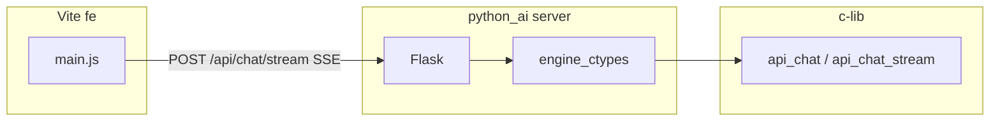

# Tutorial: Using the C library from other languages

This guide shows how to **compile the M4-Hardcore AI Engine C library** as a shared library and call it from **Python 2/3**, **Java**, **C/C++**, **JavaScript/TypeScript**, and other languages.

## 1. Build the C shared library

First build the engine as a shared library so other runtimes can load it via FFI (Foreign Function Interface).

```bash
# From project root; install prerequisites first (see README)
make lib
```

This produces:

- **macOS:** `lib/libm4engine.dylib`
- **Linux:** `lib/libm4engine.so`

Optional MongoDB support (same as the main app):

```bash
make lib USE_MONGOC=1
```

**Install docs:** [README – Prerequisites](../README.md#prerequisites-cross-platform) for compiler, ncurses, libcurl, and optional mongo-c-driver.

---

## 2. C / C++

**Use the library directly:** include headers and link against the shared (or static) library.

### Compile and link (C)

```bash
# After: make lib
clang -std=c17 -Iinclude -Llib -lm4engine -o my_app my_app.c -Wl,-rpath,lib
```

### Compile and link (C++)

```bash
clang++ -std=c++17 -Iinclude -Llib -lm4engine -o my_app my_app.cpp -Wl,-rpath,lib
```

In C++ wrap engine headers in `extern "C"` if needed (the engine API is C, so usually no change):

```cpp
extern "C" {
#include "engine.h"
}
```

**Example (C):** create engine, append chat, get stats — see `engine.h` (in the package `include/` or in repo `c-lib/include/`) for `engine_create`, `engine_append_chat`, `engine_get_stats`, etc.

**Links:** [GCC – Link options](https://gcc.gnu.org/onlinedocs/gcc/Link-Options.html) · [Clang](https://clang.llvm.org/)

---

## 3. Python 2 / 3

Load the shared library with **ctypes** (standard library) or **cffi** and call the C API.

### Python 3 (or 2) with ctypes

```python
import ctypes
import os

# Load shared library (adjust path and extension for your OS)
root = os.path.dirname(os.path.dirname(os.path.abspath(__file__)))
lib_path = os.path.join(root, "lib", "libm4engine.so")   # Linux
# lib_path = os.path.join(root, "lib", "libm4engine.dylib")  # macOS
if not os.path.isfile(lib_path):
    lib_path = os.path.join(root, "lib", "libm4engine.dylib")
lib = ctypes.CDLL(lib_path)

# Define signatures (example: ollama_query)
lib.ollama_query.argtypes = [ctypes.c_char_p, ctypes.c_int, ctypes.c_char_p,
                             ctypes.c_char_p, ctypes.c_char_p, ctypes.c_size_t]
lib.ollama_query.restype = ctypes.c_int

out = ctypes.create_string_buffer(32768)
r = lib.ollama_query(b"127.0.0.1", 11434, b"llama3.2", b"Hello", out, 32768)
if r == 0:
    print(out.value.decode("utf-8"))
```

### Python 3 with cffi (recommended for complex structs)

```bash
pip install cffi
```

```python
from cffi import FFI
ffi = FFI()
ffi.cdef("""
    int ollama_query(const char *host, int port, const char *model,
                     const char *prompt, char *out, size_t out_size);
""")
lib = ffi.dlopen("lib/libm4engine.so")  # or .dylib on macOS
buf = ffi.new("char[]", 32768)
lib.ollama_query(b"127.0.0.1", 11434, b"llama3.2", b"Hello", buf, 32768)
print(ffi.string(buf).decode("utf-8"))
```

**Install:** [Python](https://www.python.org/downloads/) · [ctypes](https://docs.python.org/3/library/ctypes.html) · [cffi](https://cffi.readthedocs.io/)

---

## 4. Java

Use **JNI** (Java Native Interface) or **JNA** (Java Native Access) to load the C library and call it.

### JNA (simplest: no C glue code)

```bash
# Add jna.jar to classpath (Maven: com.sun.jna:jna)
```

```java
import com.sun.jna.*;

public class M4Engine {
    public interface Lib extends Library {
        Lib INSTANCE = Native.load("m4engine", Lib.class);  // libm4engine.so / .dylib
        int ollama_query(String host, int port, String model, String prompt,
                         byte[] out, int outSize);
    }

    public static void main(String[] args) {
        byte[] out = new byte[32768];
        int r = Lib.INSTANCE.ollama_query("127.0.0.1", 11434, "llama3.2", "Hello", out, 32768);
        if (r == 0) System.out.println(new String(out, StandardCharsets.UTF_8).trim());
    }
}
```

Run with the library on the path, e.g. `-Djava.library.path=lib`.

### JNI (full control, requires a small C wrapper)

1. Write a C file that includes `engine.h` and implements JNI functions that call `engine_create`, `engine_append_chat`, etc.
2. Compile the wrapper into a JNI shared library and load it with `System.loadLibrary("yourjni")`.
3. [JNI spec](https://docs.oracle.com/javase/8/docs/technotes/guides/jni/) · [JNI tutorial](https://www3.ntu.edu.sg/home/ehchua/programming/java/JavaNativeInterface.html)

**Install:** [JDK](https://adoptium.net/) · [JNA](https://github.com/java-native-access/jna) · [JNI (Oracle)](https://docs.oracle.com/javase/8/docs/technotes/guides/jni/)

---

## 5. JavaScript / TypeScript (Node.js)

Use **Node-API** (N-API) or **node-ffi-napi** to load the C library from Node.

### node-ffi-napi (quick FFI)

```bash
npm install ffi-napi ref-napi
```

```javascript
const ffi = require('ffi-napi');
const path = require('path');
const libPath = path.join(__dirname, '..', 'lib', 'libm4engine.so');  // or .dylib

const lib = ffi.Library(libPath, {
  ollama_query: ['int', ['string', 'int', 'string', 'string', 'pointer', 'size_t']]
});

const buf = Buffer.alloc(32768);
const r = lib.ollama_query('127.0.0.1', 11434, 'llama3.2', 'Hello', buf, 32768);
if (r === 0) console.log(buf.toString('utf8').replace(/\0/g, ''));
```

### N-API (native addon)

Write a small C++ addon that includes the engine headers and exposes functions to JS via N-API. Build with `node-gyp` and link against `libm4engine`. [N-API documentation](https://nodejs.org/api/n-api.html)

**Install:** [Node.js](https://nodejs.org/) · [node-ffi-napi](https://www.npmjs.com/package/ffi-napi) · [N-API](https://nodejs.org/api/n-api.html)

---

## 6. Other languages (summary)

| Language | How to use the C library | Install / docs |
|----------|---------------------------|----------------|
| **Go**   | `cgo`: `#cgo LDFLAGS: -L./lib -lm4engine` then call C.engine_create(...) | [cgo](https://pkg.go.dev/cmd/cgo) |
| **Rust** | `libloading` or `libffi` crate; or build a `cdylib` that re-exports the C API | [libloading](https://crates.io/crates/libloading) |
| **Ruby** | `FFI` gem: `FFI::Library.new('libm4engine', ...)` | [Ruby FFI](https://github.com/ffi/ffi) |
| **PHP**  | `FFI::cdef()` + `FFI::load()` (PHP 7.4+) | [PHP FFI](https://www.php.net/manual/en/book.ffi.php) |
| **Swift** | Import the module from a system library or use a C bridging header | [Swift C interoperability](https://www.swift.org/documentation/c-interop/) |
| **Kotlin/Native** | `cinterop` to generate bindings from C headers | [Kotlin Native](https://kotlinlang.org/docs/native-c-interop.html) |

In all cases: (1) build the shared library with `make lib`, (2) ensure the runtime can find the library (`LD_LIBRARY_PATH`, `DYLD_LIBRARY_PATH`, or `-rpath`), (3) map C types and function signatures to the host language (as in the Python/Java/Node examples above).

---

## 7. Public C API (what to bind)

| Header    | Main symbols to bind |
|----------|------------------------|
| `engine.h` | `engine_create`, `engine_destroy`, `engine_init`, `engine_append_chat`, `engine_get_stats`; types: `engine_config_t`, `run_mode_t`, `execution_mode_t` |
| `ollama.h` | `ollama_query` (host, port, model, prompt, out, size); `ollama_query_with_options` (..., temperature, out, size). |
| `storage.h` | `storage_create`, `storage_destroy`, `storage_connect`, `storage_append_chat` (if you need storage only) |
| `tenant.h` | `tenant_validate_id` |
| `validate.h` | `validate_environment` |
| `smart_topic.h` | `initial_smart_topic`, `get_smart_topic`, `smart_topic_temperature_for_query`. See [smart_topic.md](smart_topic.md). |

Start with `ollama_query` for a minimal “ask the model” binding; add engine/storage APIs as needed. For intent-based temperature (TECH/CHAT/DEFAULT), use [smart_topic.md](smart_topic.md) and `ollama_query_with_options`.

Prefer the high-level **`api.h`** entry points (`api_create`, `api_chat`, `api_chat_stream`, …) when mirroring the shipped **Python** wrapper; see §8.

---

## 8. Integration: `python_ai` server + Vite `fe`

This section documents how the **Flask** app under **`python_ai/server`** and the **Vite** SPA under **`fe`** talk to c-lib. Keep this material here; **[FLOW_DIGRAM.md](FLOW_DIGRAM.md)** stays focused on in-library control flow.

### 8.1 ctypes `ApiOptions` must match `api.h`

The struct **`api_options_t`** in **`include/api.h`** includes, **in order**, after **`smart_topic_opts`**:

- **`inject_geo_knowledge`**
- **`disable_auto_system_time`**
- **`geo_authority`**
- **`model_switch_opts`**

The Python **`ApiOptions`** in **`python_ai/engine_ctypes.py`** must list the **same fields in the same order**. If the C struct grows and Python stops early, ctypes packs a **shorter** layout: the library still reads the full size → **wrong offsets** (garbage pointers/flags). That often surfaces only after additions such as **`model_switch_opts`**.

**Reference types in `engine_ctypes.py`:** `SmartTopicOptions`, `ModelSwitchLaneEntry`, `ModelSwitchOptions` (mirror **`smart_topic.h`** / **`model_switch.h`**), then **`ApiOptions`**.

### 8.2 Python server initialization (`python_ai/server/app.py`)

| Step | What runs | Notes |
|------|-----------|--------|
| 1 | **`load_lib()`** | Resolves **`libm4engine.dylib`** / **`.so`** via **`M4ENGINE_LIB`** or **`../c-lib/lib/`** next to `python_ai`. For real Mongo persistence and **`mongo_connected`** in stats, build with **`make lib USE_MONGOC=1`** (plain `make lib` leaves a stub: **`mongoc_linked`** is false in **`/api/stats`**). |
| 2 | **`build_max_api_options()`** or **`build_api_options()`** (`training/full_options.py`) | Server defaults to **max** unless **`M4ENGINE_SERVER_MAX=0`**. |
| 3 | **`api_create(&opts)`** | Single process-wide context. |
| 4 | **`api_load_chat_history`** on **`API_DEFAULT_TENANT_ID`** | Primes in-memory history from Mongo/cache. |
| 5 | **`atexit` → `api_destroy`** | Clean shutdown. |

**Threading:** Flask uses **`threaded=True`**. Serialize **`api_*`** on **`_ctx`** with **`_ctx_lock`**. **`api_chat_stream`** calls the token callback from a **pthread**; use **`gil_held_for_c_callback`** (`server/c_pthread_bridge.py`) before touching Python state.

**HTTP → c-lib**

| Route | c-lib | Response |
|-------|--------|----------|
| `POST /api/chat` | `api_chat` | JSON `reply`, `tenant_id`, `user` |
| `POST /api/chat/stream` | `api_chat_stream` | SSE `data: { token, temp_message_id, done, error? }` |
| `GET /api/history` | `api_load_chat_history` (optional reload) + history getters | JSON `messages[]` (`role`, `content`, `timestamp`, `source`) |

**Environment (common):** **`M4ENGINE_LIB`**, **`M4ENGINE_SERVER_PORT`** (else 5000 then 5001 — align FE proxy / **`VITE_API_URL`**), **`M4ENGINE_TENANT_STRICT`**, **`M4ENGINE_MODE`**, Mongo/Redis/ELK and smart_topic vars — see **`training/full_options.py`**.

**Model switch:** pass **`ModelSwitchOptions`** + lane table via **`ApiOptions.model_switch_opts`**, or call **`api_set_model_lane`** / **`api_set_model_lane_key`** after **`api_create`** (see **`load_lib()`** in `engine_ctypes.py`). Otherwise c-lib uses **`OLLAMA_MODEL`** / **`M4_MODEL_<KEY>`** (`.cursor/model_switch.md`).

### 8.3 Vite frontend (`fe/src/main.js`)

| Item | Purpose |
|------|--------|
| **`VITE_API_URL`** | Flask origin if not using same-origin `/api` (e.g. `http://127.0.0.1:5001`). |
| **`VITE_TENANT_ID`** | Default **`default`**; sent as **`tenant_id`** and **`user`** (must match server **`_tenant_id_bytes`** rules). |
| **`VITE_GEO_IMPORT_KEY`** | Header **`X-Geo-Import-Key`** when Flask sets **`M4ENGINE_GEO_IMPORT_KEY`**. |
| **Stream POST body** | **`message`**, **`tenant_id`**, **`user`**, **`temp_message_id`** (UUID, e.g. `crypto.randomUUID()`). |
| **After stream** | Append **`ev.token`** until **`ev.done`**; refresh **`/api/history?reload=1`**. |

**Dev stack in this repo:** **`fe/vite.config.js`** — **`server.port: 8000`**, **`proxy["/api"]` → `http://127.0.0.1:5000`**, SSE stream handling for **`/api/chat/stream`**. Flask-CORS allows **`localhost:8000`**. If Flask uses **5001**, set **`VITE_API_URL`** or change the proxy **target**.

### 8.4 Chat/stream tracing (`M4_DEBUG_CHAT`)

Set in the shell **before** starting **`python_ai/server/app.py`** (ctypes prints to **stderr**):

| Variable | Effect |
|----------|--------|
| **`M4_DEBUG_CHAT=1`** (or `true` / `yes`) | Storage snapshot (`mongoc_linked`, `mongo_connected`, `redis_connected`, ELK configured + reachability, `vector_search`, `execution_mode`); stream path (tenant, `temp_message_id`, model, temperature); **user input** + **compiled prompt (ptomp)** previews; after pump: token count/bytes, **assembled `full`** preview; **`[OLLAMA][stream] unparsed NDJSON line`** for lines that did not yield text. |
| **`M4_DEBUG_CHAT=verbose`** or **`=2`** | Same, plus each **parsed** fragment from Ollama. |
| **`M4_DEBUG_CHAT_TOKENS=1`** | Log **every** token forwarded to the Python/SSE callback (high volume). |

No changes are required in the Flask app beyond exporting these variables. Rebuild and set **`M4ENGINE_LIB`** to the library that contains this logging.



More server detail: **`python_ai/README.md`**, **`python_ai/server/app.py`** module docstring.

**See also:** [tutorial_chat_l1_memory.md](tutorial_chat_l1_memory.md) — in-process chat L1 (session map, `context_batch_size`, idle eviction, history getters).
