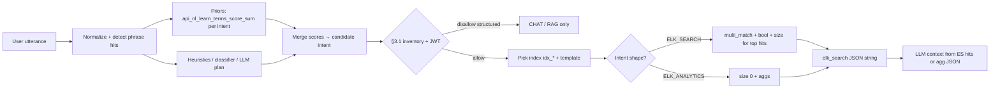

> **[DESIGN - Not implemented in c-lib]** NL routing is design discussion only. Intent taxonomy is enforced (`.cursor/rules/nl-learn-routing-intents.mdc`).

# Chat input → ELK vs RAG vs analytics (NL routing)

**Purpose:** Capture **design discussion** for the chat box: how to tell when a user wants **structured search / analytics** (often **Elasticsearch** or **MongoDB**—see §1.1), **vector RAG** (Redis / Mongo similarity), or **neither**—and how **linguistic cues** plus a **curated concept layer** (schema, synonyms) connect natural language to safe queries. This is **not** implemented as a single module in c-lib today; it complements the **data-plane** doc [elk_index_data.md](elk_index_data.md).

**Relationship to [elk_index_data.md](elk_index_data.md):**

| Topic | Where |
|--------|--------|
| What goes **into** `idx_*`, **public** / joins, **hybrid** write + read compose (`elk_search` + vector), sample query JSON | **elk_index_data.md** (especially §5–§7, §10) |
| **When** to choose ELK search vs ELK analytics vs RAG vs plain chat; cues and **concept/schema** grounding | **This file** |
| **Flow** from matched **terms** / priors → **intent** → **Elasticsearch** (or Mongo) **query shape** | **This file §4.1** |
| **Design FAQ:** first language, term vs “public rows,” index choice, LLM prompt guardrails | **This file §4.2** |

**Related:** [shared_collection.md](shared_collection.md) (collections, `public`, `metadata.field_hints`), [vector_generate.md](vector_generate.md) (**chat Redis RAG** query vectors: **`api_options_t.vector_gen_backend`** — default **custom** hash unless user sets Ollama), [smart_topic_ai_switch.md](smart_topic_ai_switch.md) (temperature/lane routing, **not** ELK intent), [elk.md](elk.md).

---

## 1. Why routing matters

One chat surface receives:

- **Conversational** turns (no retrieval).
- **Retrieval** (“what does our catalog say about …”) → vectors and/or BM25.
- **Structured questions** (“how many X this month?”, “users in HR”) → **filters + `aggs`**, not top‑k snippets alone.

Treating everything as “embed the question → nearest neighbors” fails for **counts and time windows**. Treating everything as “one `multi_match`” fails when the answer is an **aggregation**. So the product needs an **intent** (or **tool**) boundary **before** composing context for the LLM.

### 1.1 Elasticsearch **or** MongoDB for the same routed intent

Routing labels like **ELK_SEARCH** / **ELK_ANALYTICS** name the **kind** of question (keyword retrieval vs counts/aggregates). The **executor** is a product choice:

| Routed need | **Elasticsearch** | **MongoDB** |
|-------------|-------------------|-------------|
| Keyword / BM25-style **search** | `multi_match`, `bool` filters on `idx_*` | Text index / `$text` + `find` on collections (if indexed), or app-side filter |
| **Counts, sums, breakdowns** | `_search` with `size: 0` + **`aggs`** | **`aggregate()`** pipeline (`$match`, `$group`, `$count`, date bucketing) on the **same** domain collections |

**Note:** Authoritative data often **lives in Mongo** first; **ELK** may be a **derived** index (e.g. SharedCollection cold backfill). You can answer **“how many products …”** with **Mongo** only, **ELK** only, or **both** (cross-check)—mode **`M4ENGINE_MODE_MONGO_REDIS_ELK`** vs **`MONGO_REDIS`** should drive which backends are **available**, not whether the user question is “analytic.” **Tenant / JWT filters** apply to **whichever** store you query.

Intent names in §4 can stay **ELK_*** for historical wording; treat them as **“search index”** vs **“document store aggregate”** and map **Mongo** in implementation where ELK is off or data is Mongo-primary.

---

## 2. Linguistic cues (surface signals)

**Linguistic cues** are **wording patterns** that *suggest* intent without deep reasoning:

| Pattern | Often suggests |
|---------|----------------|
| “how many”, “count”, “number of”, “total”, “sum”, “average” | **Analytics** (ES `aggs`, SQL, Mongo pipeline)—not chunk RAG. |
| “this month”, “last quarter”, “between …”, “YTD” | **Time-bounded** query; needs calendar + timezone policy. |
| “in HR”, “status shipped”, “in California” | **Filters** on dimensions (if your schema has matching fields). |
| “find”, “show”, “list”, “search for” + product/order language | **Search** (`multi_match` + filters), possibly **plus** vectors. |

Cues are **heuristic**: “how many ways …” may be chat. Use them as **priors**, not absolute rules.

### 2.1 Cues you can **learn** or **extract** from inputs (slot-style)

From utterances like *“how many provinces in Vietnam?”*, *“how many products in storage?”*, *“how many orders in pending_stage?”*, *“how many users of department hr?”* you can consistently pull **features** to log and to drive **term → map** updates (§9):

| Cue type | What to detect | Example fragments | Use |
|----------|----------------|-------------------|-----|
| **Quantifier frame** | Tokens/phrases that mark a **count / metric** ask | `how many`, `count`, `number of`, `let count`, `total` | Boost **analytics** intent (ES **`aggs`** or **Mongo `aggregate`**) vs pure chat; store as **term** keys for learning. |
| **Head noun / entity** | Noun after quantifier (often **subject** of “how many X”) | `provinces`, `products`, `orders`, `users` | **Entity resolution**: match X to **closed list** (SC `collection`, aliases). Learn co-occurrence **quantifier + entity** → intent. |
| **Preposition + span** | `in …`, `of …`, `with …`, `from …` plus following tokens | `in vietnam`, `in storage`, `in pending_stage`, `of department hr` | **Filter slots**: map spans to fields (`country`, `warehouse`, `status`, `department`) when schema allows; otherwise log as **raw n-gram** for future synonym mining. |
| **Proper / geo tokens** | Capitalized or gazetteer hits | `Vietnam`, `HR` (also acronym) | **Geo** vs **org** vs **field value** disambiguation; can learn `vietnam+provinces` → CHAT/knowledge vs `vietnam+sales` → ELK if you have data. |
| **Underscore / code-like tokens** | Identifier-shaped words | `pending_stage` | Strong hint of **schema field name**—high value for **`term` / equality** filters in **ES or Mongo**; learn phrase → template id. |
| **Domain lexicon hits** | Words from your product list (product, order, cart, sku, tenant, …) | `products`, `orders`, `users` | **Prior** toward **indexed search / analytics** (ELK or Mongo) when combined with quantifier; frequency in logs updates **map** weights. |

**Learning loop (conceptual):** after you **choose** an intent and run a tool, **increment** counts for:

- the **quantifier** n-gram(s) found;
- **(quantifier, head_noun)** pair;
- any **matched filter span** (`pending_stage`, `department hr`) tied to that template.

That is **what** is “learned from those inputs”—not the full semantics, but **recurring surface patterns** that correlate with successful routes. **Entity** still must pass **inventory** checks (§3.1); learning adjusts **weights among allowed** paths, not permission to query unknown indices.

### 2.2 Extracted output sample — row **`"how many": { }`**

Use one object **per user turn**. The key **`how many`** (or **`count`**, **`number of`**, …) is the **canonical quantifier** your detector matched; the value is **slots + hints** for routing and for **term → map** updates (§9). Fields are **optional** if absent.

**Shape:**

```json
{
  "input": "<original user text>",
  "extraction": {
    "how many": {
      "quantifier": "how many",
      "head_noun": "<entity after quantifier>",
      "head_lemma": "<optional stem>",
      "filter_spans": ["<literal prepositional chunks>"],
      "code_like_tokens": ["<e.g. pending_stage>"],
      "geo_tokens": ["<e.g. vietnam>"],
      "proper_tokens": ["<e.g. HR>"],
      "inventory_hit": "<products|orders|users|null>",
      "suggested_intent": "<ELK_ANALYTICS|CHAT|...>"
    }
  }
}
```

If the user wrote **“Let count me provinces…”**, the row key might be **`count`** instead of **`how many`**—use **one** row per matched **quantifier pattern**.

**Sample rows (four inputs):**

```json
[
  {
    "input": "how many provinces in vietnam?",
    "extraction": {
      "how many": {
        "quantifier": "how many",
        "head_noun": "provinces",
        "filter_spans": ["in vietnam"],
        "code_like_tokens": [],
        "geo_tokens": ["vietnam"],
        "proper_tokens": [],
        "inventory_hit": null,
        "suggested_intent": "CHAT"
      }
    }
  },
  {
    "input": "how many products in storage?",
    "extraction": {
      "how many": {
        "quantifier": "how many",
        "head_noun": "products",
        "filter_spans": ["in storage"],
        "code_like_tokens": [],
        "geo_tokens": [],
        "proper_tokens": [],
        "inventory_hit": "products",
        "suggested_intent": "ELK_ANALYTICS"
      }
    }
  },
  {
    "input": "how many orders in pending_stage?",
    "extraction": {
      "how many": {
        "quantifier": "how many",
        "head_noun": "orders",
        "filter_spans": ["in pending_stage"],
        "code_like_tokens": ["pending_stage"],
        "geo_tokens": [],
        "proper_tokens": [],
        "inventory_hit": "orders",
        "suggested_intent": "ELK_ANALYTICS"
      }
    }
  },
  {
    "input": "how many users of department hr?",
    "extraction": {
      "how many": {
        "quantifier": "how many",
        "head_noun": "users",
        "filter_spans": ["of department hr"],
        "code_like_tokens": [],
        "geo_tokens": [],
        "proper_tokens": ["HR"],
        "inventory_hit": "users",
        "suggested_intent": "ELK_ANALYTICS"
      }
    }
  }
]
```

**`suggested_intent`** here is illustrative; your router must still apply **§3.1** (inventory, JWT). **`inventory_hit`** is `null` when the head noun is **not** on the closed list.

---

## 3. Concepts and properties (curated layer)

**Concepts** = domain types you care about (Order, Employee, Product, Sale).  
**Properties** = attributes in your data model (`order_date`, `department`, `category`).

To run **structured** queries safely (whether **Elasticsearch** or **MongoDB**) you must **anchor** language to **indices/collections and fields**:

- **Pre-defined or curated** from real schema (Mongo, ES mappings, SharedCollection registry).
- **Synonym tables** optional: “HR” → `department.keyword: "Human Resources"`.
- **metadata.field_hints** in SharedCollection (spec) can document meaning for prompts; **routing** may reuse the same names in a separate **intent config** when you implement it.

You **discover** the domain over time; you **encode** what you learned in config. That encoding **is** the “properties of concepts” layer—not necessarily a full ontology, but **enough** to map user phrases to **allowed** `_search` / `_aggregate` templates.

### 3.1 Same “how many” shape — not always ELK

Phrases like **“how many …”** / **“count …”** look alike, but the **right backend** depends on whether the **entity** is **your indexed / stored data** or **general knowledge**.

| Example user input | Typical backend | Why |
|--------------------|-----------------|-----|
| “Let count me provinces of Vietnam?” / “How many provinces in Vietnam?” | **CHAT / knowledge** (LLM, or a curated **geo** tool) — **ELK only if** you actually store **provinces** in an index or Mongo collection you query (e.g. **`geo_atlas`**, a national reference dataset). | “Vietnam” + “provinces” is often **trivia**, not `idx_products`. No matching **concept** in your schema ⇒ **do not** fire ELK. |
| “How many products in storage?” | **ELK_ANALYTICS** or **Mongo count** when **products** maps to **`idx_*` / `products`** in SharedCollection. | Entity **product** is on your **closed list** + field/meaning for “in storage” (e.g. warehouse flag, collection name). |
| “How many orders in pending_stage?” | **ELK_ANALYTICS** *or* **Mongo aggregate** (`$match` on `pending_stage` / status) when **orders** exist in **ES and/or Mongo**. | Same: **order** ∈ known concepts + **pending_stage** maps to a real field in the store you query. |
| “How many users of department hr?” | **ELK_ANALYTICS** or DB **aggregate** when **users/employees** + **department** exist. | **HR** → synonym map to `department.keyword`; tenant filter from JWT. |

**Rule of thumb:** **“How many”** is only a **cue**; **entity resolution** decides ELK vs not:

1. **Normalize** the question and extract a **candidate entity** (products, orders, users, provinces, …).  
2. If the entity is in your **curated inventory** (SharedCollection **`collection`** names, alias table, or routing config) → allow **analytics / search** templates for that entity (**Elasticsearch** and/or **MongoDB**, per deployment).  
3. If **not** in inventory → **CHAT** or **RAG** over **general** docs (if you have any), **not** arbitrary queries on business indices/collections.

**Lots of “how many X”** in the wild means your **inventory** and **synonyms** (X → index + field) must stay explicit; self-learning **counts** (§5–§9) then refine *which* template wins among **allowed** options—they should not **invent** new indices.

---

## 4. Intent taxonomy (suggested)

| Intent | Typical **Elasticsearch** use | Typical **MongoDB** use | Context shape for LLM |
|--------|------------------------------|-------------------------|------------------------|
| **ELK_SEARCH** (search) | `multi_match` + `bool` filters, `size` > 0 | `find` / `$text` (if text index) + projection on **public** fields | Short **snippets** / field subset. |
| **ELK_ANALYTICS** (aggregate) | `size: 0` + **`aggs`** (date_histogram, terms) | **`aggregate`**: `$match` + `$group` / `$count` / facet buckets | **Numeric / tabular** JSON summary as “ground truth.” |
| **RAG_VECTOR** | — | Redis L2 / optional Mongo vector | Past turns or catalog chunks (existing `api.c` path for chat). |
| **CHAT** | — | — | No retrieval block, or only system/session text. |

**Two structured modes** matter: **retrieve** vs **aggregate**. Either backend can satisfy them; **engine mode** (Mongo-only vs Mongo+ELK) decides what is **wired**, not the user’s phrasing.

### 4.1 Flow: matched terms → intent → ELK (or Mongo) query composition

**Important:** Learned **terms** (`nl_learn_terms`, §8) store **counts per `(phrase, intent)`**. They **do not** store query JSON. They **bias** which **intent** (route family) wins; **you** still compose the actual **`_search` body** (or Mongo pipeline) in the gateway / tool layer using **SharedCollection** index names, **public** fields, and **JWT filters**.

**End-to-end (target product flow):**



**Step-by-step (checklist):**

| Step | Input | Output | Notes |
|------|--------|--------|--------|
| 1. **Phrase detection** | Normalized text | List of **term keys** that appear (substring / longest-first / trie) | Same keys you use for **`api_nl_learn_terms_score_sum`**; align with **`nl_learn_terms`** JSON keys. |
| 2. **Intent priors** | Term keys | Per-intent **scores** from c-lib **`api_nl_learn_terms_score_sum`**, optional weights | Priors **add to** heuristics; they do not replace §3.1. |
| 3. **Intent decision** | Scores + rules | One of **§4** labels (`ELK_SEARCH`, `ELK_ANALYTICS`, …) | Hybrid: strong “how many” regex can **floor** analytics; priors break ties. |
| 4. **Grounding** | Entity / collection language | **Allowed** `idx_*` name + fields from **SharedCollection** + **tenant filter** | No index name from free text without allowlist. |
| 5. **Template → JSON** | Intent + slots (keywords, date range, filters) | Elasticsearch **`_search`** body (string) or Mongo **`aggregate`** | **ELK_SEARCH:** `query.bool` with **`must` `multi_match`** on safe text fields + **`filter`** (tenant, status, range). **ELK_ANALYTICS:** **`size`: 0** + **`aggs`** (`terms`, `date_histogram`, …). |
| 6. **Execute** | JSON + index | Hits or aggregation JSON | c-lib today: **`elk_search(ctx, index, query_json, …)`** — see [elk_index_data.md](elk_index_data.md) **§7** (hybrid / compose) and **§10** (example analytics body). |
| 7. **LLM** | ES (or Mongo) result | Answer with **grounded** snippets or tables | RAG path uses **RAG_VECTOR** instead of or **in addition to** ELK per product. |

**Where code lives today vs later:**

| Piece | Today | Later |
|-------|--------|--------|
| Term priors | **`nl_learn_terms`** + **`api_nl_learn_terms_*`** | Phase 2 Mongo merge (§10) |
| Phrase → intent cues (bootstrap) | **`python_ai/server/nl_learn_terms_bridge.py`** | Same + **executed-intent** recording |
| **Composing** `multi_match` / `aggs` JSON | **Application** (Python gateway, admin tools) — not inside **`nl_learn_terms.c`** | Optional shared **template library** keyed by `(intent, collection)` |

**One-line summary:** **Terms suggest the route family; inventory + policy pick the index; intent picks the query skeleton (search vs aggs); slot-filling produces the JSON you pass to `elk_search`.**

### 4.2 Design FAQ (review notes)

Condensed answers for **language**, **matching**, **index selection**, and **prompt policy**—same ideas as §4.1, phrased for onboarding.

#### 4.2.1 “First language?”

| Meaning | Recommendation |
|---------|----------------|
| **Product / detection locale** | Start with **one** natural language for cue phrases and term keys (often **English**). Add **Vietnamese** (or others) only with **parallel phrase lists** and normalization (diacritics, tokenization). Do not assume one term list fits all locales without that work. |
| **Where to implement routing + query compose** | **First** in **`python_ai`** (gateway): JWT, Mongo, LLM, and templates already live there. Keep **c-lib** for **`nl_learn_terms`** scores and engine; avoid composing raw ELK JSON inside C unless there is a strong reason. |

#### 4.2.2 “Match term → public rows → compose query?”

**Terms do not usually mean “scan Elasticsearch for substring hits on public fields”** to decide the route. Prefer this pipeline:

| Stage | Role |
|-------|------|
| **A — Route family** | User text + **learned priors** (§8) + heuristics → **intent** from §4 (`ELK_SEARCH`, `ELK_ANALYTICS`, `RAG_VECTOR`, `CHAT`). |
| **B — Entity / collection** | Text + **§3.1 inventory** (SharedCollection **`collection`** names, aliases) → **which domain** (e.g. products vs orders). **Terms alone do not prove entity**—you need a **closed list** or trusted NER. |
| **C — Index** | **B** + registry → concrete **`idx_*`** (SharedCollection **`elk.index`**); see §4.2.3. |
| **D — Query skeleton** | **Intent:** search → `bool` + `multi_match` on **allowlisted public text fields**; analytics → `size: 0` + `aggs`. Details and samples: [elk_index_data.md](elk_index_data.md) §7, §10. |
| **E — Slots** | User keywords → `multi_match` query string; dates → `range` on a **known** field; tenant → **mandatory `filter`**. |

**Public fields** (see [elk_index_data.md](elk_index_data.md), [shared_collection.md](shared_collection.md)) define **what may appear in composed bodies and prompts**—they are **not** the same as “run a full-index grep for the term string” for routing.

#### 4.2.3 “Which index?”

1. Resolve **entity** to a **collection** using **your** catalog / aliases (§3.1).
2. Read **`elk.allow`** and **`elk.index`** for that row in **SharedCollection** (often `idx_{collection}` or an explicit name).
3. **Never** let the model **invent** index names—only **choose among** an allowlist derived from config + JWT.

If the entity is **not** in inventory → **no** business index → **CHAT** or **RAG** on docs you control, not arbitrary `idx_*`.

#### 4.2.4 Prompt / context guidelines for the LLM — yes or no?

**Yes, but narrow.**

| Do | Do not |
|----|--------|
| Pass **retrieval results** already executed (snippets, aggregation tables) with **short provenance** (e.g. index name, tenant scope). | Ask the model to **pick** raw **`idx_*`** names or field paths from memory. |
| State policy: answer only from **provided context**; if missing, say so. | Let the model emit **unsanitized** Elasticsearch JSON built from free-form user text (injection / hallucinated fields). |

**Pattern:** optional JSON **plan** from the LLM using **enums only** (`intent`, `collection_id` from a closed list) → **your code** maps to **templates** and calls **`elk_search`** (or Mongo). That balances flexibility and safety.

---

## 5. Router patterns (implementation options)

1. **Heuristics first** — Regex / keyword lists for “how many”, “this month”; cheap and auditable.
2. **Small classifier** — Extra labels beyond smart_topic (e.g. `ELK_SEARCH` vs `ELK_ANALYTICS`); one micro-call or sidecar model.
3. **LLM structured output** — JSON plan with **allowed** index names and field names from a **closed list** (reduce injection and hallucinated fields).
4. **Hybrid** — Heuristics **force** analytics path when strong; classifier for the rest.
5. **Temporary: file on disk** — Store **labeled examples**, **synonym lines**, or **keyword lists** in a **JSON/YAML/text** file under `server/data/` (or similar), load at startup or on **`SIGHUP` / mtime** refresh—same spirit as **`shared_collection_json_path`**, but for **routing only**. **Validate** on load (closed set of intents / index names); do **not** put secrets in the file; multi-instance deployments need a **consistent path** or accept per-node copies until you move to DB/admin.
6. **Self-learning via counts/scores (file-backed)** — Maintain a **mutable** map: e.g. **feature** (normalized phrase, regex id, or embedding cluster id) → **per-intent counts** or weights. After each turn (or on explicit feedback), **increment** the pair `(feature, chosen_intent)`; at route time pick **argmax** over intents (optionally mixed with fixed heuristics). Persist with **atomic write** (temp file + rename). This is **frequency learning**, not neural training—still keep a **closed list** of intents/tools and **mandatory JWT filters**; add **decay** or caps to limit drift and abuse.

**Tenant / JWT:** Any ELK (or DB) call must include **mandatory filters** derived from auth; routing does not replace **authorization**.

---

## 6. smart_topic vs ELK routing

**smart_topic** (c-lib) picks **temperature** and optionally **model_switch lane** from a **micro-classification** (TECH / CHAT / …). It does **not** today mean “call `elk_search`.” ELK routing is a **separate** axis: you can add new labels or a **second** lightweight step, or extend policy in the **application** layer (Python gateway) where JWT and tool lists live.

---

## 7. Traceability

- **Data plane** (compose, hybrid target, example `_search` bodies): [elk_index_data.md](elk_index_data.md).
- **Control plane** (when to use ELK, cues, concepts): **this file**—update both when you change how chat composes context from Elasticsearch.
- **Terms → intent → query JSON** (checklist + diagram): **§4.1** above; concrete **`aggs` / `multi_match`** samples: **elk_index_data.md §7, §10**.
- **Onboarding FAQ** (language, term vs public, index ID, LLM guardrails): **§4.2**.

---

## 8. Self-learning **terms** — `nl_learn_terms` (c-lib)

**Implemented (c-lib):** **`include/nl_learn_terms.h`**, **`src/nl_learn_terms.c`** — in-memory **term → per-intent counts**, **`m4_ht`** storage, **no** `elk_*` / `mongoc_*`. **On-disk:** **JSON v2** (path ends in `.json` or file starts with `{`) — structured **`terms`** object; each term value is an object with required **`map`**: `{ "INTENT": <integer count>, … }`. Optional extra keys per term (e.g. **`meta`**) are **ignored on load** and **not emitted on save** (the engine round-trips counts only—editors should not rely on `meta` surviving a flush unless you add merge logic later). **TSV v1** (`NL_LEARN_TERMS_FILE_MAGIC` + `term<TAB>intent<TAB>count` rows) remains supported for non-`.json` paths. Atomic write (`.tmp` + rename). Wired via **`api_options_t.learning_terms_path`** + **`enable_learning_terms`** + **`defer_learning_terms_load`** (default **on** in Python: background pthread at **`api_create`**; **`record`/`save`/`score_sum` no-op until ready** — safe immediate chat) and **`api_nl_learn_terms_*`** on **`api_context_t`**. Set **`M4_DEFER_NL_LEARN_LOAD=0`** for synchronous open (legacy: **`api_create` fails** if the file cannot load). Python default file: **`python_ai/server/data/nl_learn_terms.json`**. Python: **`engine_ctypes.ApiOptions`**, **`training/full_options.py`** (`M4_LEARNING_TERMS_PATH`, `M4_ENABLE_LEARNING_TERMS`, `M4_DEFER_NL_LEARN_LOAD`, admin **`OPTION_KEYS`**).

| Piece | Status |
|--------|--------|
| **Name** | **`nl_learn_terms`** — NL routing priors, not Elasticsearch-specific. |
| **App-level switch** | **`enable_learning_terms`**: 0 = load/score only (no `record` mutations / no persist on destroy); non-zero = allow increments + save. |
| **Mongo-only stacks** | Same priors apply **before** choosing Mongo `aggregate` vs ELK vs CHAT (§1.1). File path can live on shared storage until **§10 Phase 2**. |

**Anti-pattern:** Moving term counting into **`elk_*`** or **`storage_elk_*`** — keep learning **backend-agnostic**.

### 8.1 Strict rules — purpose of route learning terms

These rules define **what** “learning routes” means in this repo: **frequency priors** for **NL routing**, not model training, not ELK-specific logic, and not a bypass for auth or schema.

| Rule | Requirement |
|------|-------------|
| **R-L1 — Single purpose** | Route learning **only** maintains **counts** (or scores) for **`(term, intent)`** pairs so a router can **bias** among options on the **closed intent list** (§4). It does **not** store full utterances as training corpora, does **not** replace **§3.1** concept/inventory checks, and does **not** choose **which** index or Mongo collection to hit—that remains **config + JWT + executor**. |
| **R-L2 — Intent = route shape, not “Elasticsearch only”** | Names **`ELK_SEARCH`** and **`ELK_ANALYTICS`** denote **search-shaped** vs **aggregate-shaped** questions (§1.1). **Today** you may run those primarily against **Elasticsearch**; **MongoDB** is an **equal-class executor** for the same labels (`find` / `$text` vs **`aggregate`**). Do **not** rename intents per backend; map **executor** in engine mode, not in the learning key. |
| **R-L3 — c-lib boundary** | **`nl_learn_terms`** (§8) implements **in-memory map + file load/save** (JSON v2 and/or TSV v1) only. **No** `mongoc_*`, **no** `elk_*` inside that module. **MongoDB** for durable or multi-instance learning is **Phase 2** (§10.1), implemented in **python_ai** (or a worker), not inside **`nl_learn_terms.c`**. |
| **R-L4 — Closed intent vocabulary** | Every persisted **`intent`** string **MUST** match §4 (or a **documented** extension of that set). Reject unknown labels at ingest (JSON/TSV load, Mongo upsert, `/term/*` parser). **Enforced in code:** **`nl_learn_terms.c`** (`intent_on_closed_list` — default strict) and **`python_ai/server/nl_learn_terms_bridge.py`** (`NL_LEARN_ALLOWED_INTENTS` / `nl_learn_intent_allowed`). Legacy rows with other intent names are **skipped on load** unless **`M4_NL_LEARN_RELAX_INTENT`** is set (truthy); same env relaxes the C and Python checks. |
| **R-L5 — Auth and inventory still win** | Learned priors **MUST NOT** override **tenant isolation**, **field/collection allowlists**, or **JWT-derived filters**. At most they reorder or suggest among **already-allowed** routes. |
| **R-L6 — Recording policy (ideal vs bootstrap)** | **Ideal (target):** increment **`(term, executed_intent)`** where **`executed_intent`** is the intent the gateway **actually applied** for that turn (after router + guards). **Bootstrap (current Python):** **`python_ai/server/nl_learn_terms_bridge.py`** may record **tier cues** from the user line after a **successful** turn (phrase → intent aligned to §4); treat this as **prior reinforcement** until the router emits a definitive label every time. Do **not** increment **`ELK_ANALYTICS`** / **`ELK_SEARCH`** for a turn that **only** ran plain **CHAT** unless your policy explicitly treats cue-only updates as intentional (prefer **executed-intent** alignment long term). |
| **R-L7 — Phase 2 = MongoDB durability for counts** | **Phase 2** (**§10.1**) **SHOULD** use **`nl_learn_term_counts`** in **MongoDB** as the **durable** store for organic **`(tenant_id, term, intent)`** statistics (authoritative, mirror, or merge-at-startup per chosen sync mode). File-backed **JSON/TSV** remains what **c-lib loads** until export/merge/hot-reload is in place. |
| **R-L8 — Phase 3 = MongoDB overrides + ABAC** | **Phase 3** (**§10.2**) **SHOULD** store staff **`/term/*`** bindings in **`nl_learn_term_overrides`** in **MongoDB** and enforce **ABAC** in the same gateway layer as admin APIs. Router precedence: **override → learned counts → heuristics** (§10.3). |

**Summary:** Learning terms exist to make **repeat user phrasing** converge on the **right route family** (search vs aggregate vs RAG vs chat) for **ELK and/or Mongo** executors; **MongoDB** is the **planned** system of record for counts and overrides in Phases 2–3, while **c-lib** stays file + memory for the engine process.

### 8.2 Python cue tiers (bridge ↔ §4)

**Source of truth for phrase lists in Python:** **`python_ai/server/nl_learn_terms_bridge.py`** (module docstring + `nl_learn_all_cue_pairs`). **At most one** `(phrase, intent)` per **tier** per utterance (**longest substring** wins inside that tier); **multiple tiers** may fire on one message (e.g. quantifier + time window).

| Tier order | Role | Typical `intent` (§4) |
|------------|------|------------------------|
| 1 — Quant / metric | Counts, totals, per-period volume language | **`ELK_ANALYTICS`** |
| 2 — Search / list | Find, show, list, catalog, “on sale”, … | **`ELK_SEARCH`** |
| 3 — Time window | This year, last month, YTD, … | **`ELK_ANALYTICS`** |
| 4 — Doc / policy | Knowledge base, manual, “what does the doc”, … | **`RAG_VECTOR`** |
| 5 — Extra analytics | YoY, breakdown, top N, average, … | **`ELK_ANALYTICS`** |

Optional env **`M4_NL_LEARN_RECORD_FALLBACK`**: c-lib records **`chat` / `CHAT`** when no cue matches. Successful chat turns trigger **`nl_learn_cues_record_from_utterance`** + **`nl_learn_terms_save`** internally when **`enable_learning_terms`** is on (no app-level record API).

**Next:** Multi-instance and tenant-scoped truth → **§10 Phase 2 (MongoDB)**; staff correction UX → **§10 Phase 3 (MongoDB + ABAC)**.

---

## 9. Appendix: self-learning struct sketch (`term` + `map`)

**Idea:** each **keyword / normalized phrase** (`term`) owns a **`map`** from **intent name** → **count** (or count + decayed **score**). On each routed turn, increment the entry for the term(s) you matched and the intent you applied; at route time combine counts with heuristics (argmax / weighted sum).

**On-disk JSON v2 (c-lib `NL_LEARN_TERMS_JSON_SCHEMA` = `nl_learn_terms_v2`):** top-level **`schema`**, **`terms`** object; each term is a struct with **`map`** only required field (intents → integer counts). **`meta`** or other keys are **skipped by the engine** today—safe for human notes / future fields.

```json
{
  "schema": "nl_learn_terms_v2",
  "terms": {
    "how many": {
      "map": { "ELK_ANALYTICS": 42, "ELK_SEARCH": 3, "RAG_VECTOR": 1, "CHAT": 5 },
      "meta": { "note": "optional — not read by c-lib yet" }
    },
    "this month": {
      "map": { "ELK_ANALYTICS": 28 }
    },
    "find product": {
      "map": { "ELK_SEARCH": 19, "RAG_VECTOR": 11 }
    }
  }
}
```

**Future richer `map` values** (per-intent `{ "count", "score" }` objects) are **not** implemented in c-lib yet; keep **integers** in **`map`** for compatibility.

**Optional top-level:** `aliases` (synonym → canonical `term`), or `per_tenant.{tenant_id}.terms` if counts must not mix tenants. **Persist** with atomic replace; keep intents on a **closed list** (see §5–§6).

### 9.1 How to detect `term` in user input

Pick one or stack them (cheap first):

| Method | How it works | Good for |
|--------|----------------|----------|
| **Substring / phrase** | After **normalize** (lowercase, collapse spaces, maybe strip punctuation), test whether `term` appears in the string: `if term in text`. | Multi-word cues: `"how many"`, `"this month"`. |
| **Word boundary** | Regex or split: match `term` as **whole token(s)** so `"many"` does not fire inside `"remany"`. Use `\b` in regex or compare against a **token set** from split. | Short keywords: `"count"`, `"total"`, `"hr"`. |
| **Longest-first scan** | Sort stored `term` keys by **length descending**; walk the string and take the **first non-overlapping** longest match (or allow overlap and **sum** scores). | Avoids `"month"` winning over `"this month"` incorrectly if you process short keys first. |
| **Trie / Aho–Corasick** | Build once from all `term` strings; **one pass** over input finds every keyword occurrence—fast when you have **hundreds** of terms. | Scale; same semantics as substring but O(n) input. |
| **Token + stem (optional)** | Split on whitespace, optional **stem** (e.g. Porter) or lemmatize, match against stemmed term list. | English inflection: `sales` / `sale`—adds complexity. |
| **Embedding similarity** | Embed user message (or sentence), compare to **prototype** embeddings per `term`; threshold → hit. | Paraphrases; costs latency and needs training/calibration. |

**Practical pipeline:**

1. **Normalize** input (Unicode NFKC, lowercase, trim, collapse spaces).  
2. Apply **`aliases`** (replace synonym phrases with canonical keys).  
3. **Detect** with **longest phrase match** or **Aho–Corasick** over your `terms` keys.  
4. Merge with **heuristics** (regex for dates, “how many”) so fixed rules and learned counts agree.

**Learning update:** increment `map[intent]` only for `term`s that **actually matched** this message (and the intent you executed), so you do not reinforce spurious keys.

### 9.2 “How many provinces in Vietnam?” — still learning, but **not** ELK

**You should still count it** toward learning if you want the router to repeat the right behavior next time — but the **`intent` you increment is the one you actually used**, usually **`CHAT`** (or a dedicated **`KNOWLEDGE`** label), **not** `ELK_ANALYTICS` or `ELK_SEARCH`.

| Do | Don’t |
|----|--------|
| After answering via LLM / geo tool, **+1** for terms like `how many`, `how many|provinces`, or `provinces|vietnam` under **`CHAT`** (or `KNOWLEDGE`) in **`map`**. | **+1** to **`ELK_*`** for that turn unless you **really** ran a **structured** query (**Elasticsearch** and/or **MongoDB** aggregate/search). |
| Teaches: “this phrasing → **don’t** open `idx_products`.” | Would wrongly teach that trivia questions are **business analytics**. |

**Optional policy:** if **`inventory_hit`** is **`null`** and you skip all tools, you may **omit** an update to avoid noise — but you then lose a **negative signal** that keeps “provinces + Vietnam” off ELK. Prefer **recording under CHAT** when you are confident that was the path.

---

## 10. Roadmap — Phase 2 (MongoDB) and Phase 3 (MongoDB + ABAC + `/term/*` chat)

**Strict scope:** Phases **2** and **3** add **MongoDB** as the **durable control plane** for route learning—**counts** (Phase 2) and **staff overrides** (Phase 3). They do **not** change the rule that **`nl_learn_terms.c`** has **no** Mongo driver (**R-L3** / §8.1); sync is **python_ai**, export/merge, or a sidecar.

This section is a **product/implementation plan** only; it does not change the c-lib **`nl_learn_terms`** boundary (still **no Mongo inside** that module unless you explicitly choose a later “Phase 2b” below).

### 10.1 Phase 2: MongoDB integration (learned counts)

**Goal:** Durable, **multi-instance**, and optionally **per-tenant** term statistics in **MongoDB** (`nl_learn_term_counts`, §10.1 table below) without relying on a single host’s local TSV as the **only** long-term source of truth.

**Principles**

1. **Keep c-lib pure** — `nl_learn_terms` stays file + memory + `api_nl_learn_terms_*` (§8). Mongo I/O belongs in **python_ai** (or a sidecar worker), not inside `nl_learn_terms.c`.
2. **Single writer to the file the engine uses** — Avoid two processes appending the same path; pick one **sync hub** (see modes below).
3. **Separate concerns** — **Learned counts** (frequency from routed turns) vs **admin pins** (Phase 3) should be **different collections or document `source` fields** so merges are auditable.

**Suggested Mongo collections (names illustrative)**

| Collection | Role | Sketch |
|------------|------|--------|
| **`nl_learn_term_counts`** | Organic learning | Documents e.g. `{ tenant_id, term_key, intent, count, updated_at }` with compound index `(tenant_id, term_key, intent)` **or** one doc per `(tenant_id, term_key)` with subdocument `map: { ELK_ANALYTICS: n, … }` (align intent names with §4 **closed list**). |
| **`nl_learn_term_overrides`** (Phase 3) | Staff bindings | `{ tenant_id, phrase_normalized, intent, priority, created_by_user_id, created_at, expires_at? }` — router checks **override first**, then **counts**, then heuristics. |

**Sync modes (pick one per deployment)**

| Mode | Flow | Pros / cons |
|------|------|----------------|
| **A — Mongo authoritative, TSV export** | On a schedule or after admin/learning events: aggregate Mongo → generate TSV → atomic replace **`learning_terms_path`** → **restart** or **hot reload** hook (future) so `api_create` reloads. | Simple; c-lib unchanged; restart may be needed today. |
| **B — TSV authoritative, Mongo mirror** | Engine keeps writing TSV; async job **tails** or **polls** mtime, upserts Mongo for analytics / multi-region read models. | Good if you must keep file as the only thing c-lib reads. |
| **C — Process-local TSV + Mongo merge at startup** | `api_create` path still TSV; **Python** before spawn merges **Mongo deltas** into TSV (or passes a **merged temp file** path in **`learning_terms_path`**). | One-shot consistency per process start; handle merge rules (sum counts, max timestamp wins). |

**Migration from file-only**

1. Export existing TSV → import script → `nl_learn_term_counts`.
2. Enable **Mode A** or **C**; keep **`enable_learning_terms`** semantics: increments happen inside c-lib on each persisted chat turn, then **flush** to Mongo on an interval or on shutdown in addition to file save.

**Tenant isolation**

- **Default:** all keys scoped by **`tenant_id`** from JWT / chat context; never mix tenants in one aggregate document without an explicit `tenant_id` field.
- **Global defaults:** optional `tenant_id: null` row for platform-wide priors — apply only when tenant has no row (document policy in router).

**Optional Phase 2b (only if needed)**

- Extend **python_ai** to call Mongo directly for routing scores **without** c-lib (recommended), or add a **thin** `api_nl_learn_terms_merge_from_blob()` later — **do not** pull `mongoc` into `nl_learn_terms.c` unless you accept a new dependency boundary.

---

### 10.2 Phase 3: MongoDB overrides + ABAC via chat (`/term/agree` and friends)

**Goal:** Persist staff corrections in **MongoDB** (`nl_learn_term_overrides`) and let **authorized** roles correct or pin routing from the **chat box** using a **command prefix**, e.g. binding **`how many`**-style phrases to an intent, without exposing the same power to end users.

**Command surface (illustrative grammar)**

Parse **only** when the user message matches a reserved prefix (strip before LLM normal chat):

| Command | Intent | Example |
|---------|--------|---------|
| **`/term/agree <phrase> <INTENT>`** | **Pin** normalized phrase → intent on **closed list** (§4). | `/term/agree "how many" ELK_ANALYTICS` |
| **`/term/unpin <phrase>`** | Remove override for phrase (optional). | `/term/unpin "how many"` |
| **`/term/status <phrase>`** | Reply with current **override + top learned intents** (read-only; still gated). | `/term/status "how many"` |

- **`<phrase>`** — quoted or last tokens; **normalize** the same way as §9.1 (lowercase, collapse spaces, optional alias expansion).
- **`<INTENT>`** — must validate against **allowlist** (`ELK_ANALYTICS`, `CHAT`, …); reject unknown labels and **log security event**.

**ABAC / authorization**

- **Do not** trust chat text alone — resolve **JWT** (existing **`docs/AUTH_JWT.md`** / **`docs/ABAC_PRODUCT_TEST_PLAN.md`** flow).
- **Minimum bar:** role **`ADMIN`**, or **`HR`** only if you explicitly want HR to tune routing (usually **ADMIN-only**).
- **Preferred:** new **policy resource** e.g. **`nl_routing`** with action **`manage_terms`** (or reuse **`admin.bot`**-style bundle), checked in the **same** layer as **`/api/admin/*`** (`admin_routes.py`, `policy_store.py` patterns).
- **Deny by default:** non-staff users get **no** `/term/*` handling (treat as normal user message or reply “unknown command” **without** revealing admin commands — product choice).

**Data path**

1. Authorized `/term/agree` → validate phrase + intent → **upsert** **`nl_learn_term_overrides`** (Phase 2 collection).
2. **Router** (Python pre-LLM or post-classifier): **if** override exists for tenant + phrase hit → **force or boost** that intent; still apply **§3.1** inventory/JWT (override must not **bypass** data authorization).
3. Optionally extend c-lib with an internal merge hook for staff overrides so **file-backed** scores match without a second store — **or** keep overrides **only** in Mongo and apply **before** reading **`api_nl_learn_terms_score_sum`** (cleaner separation).

**Audit and safety**

- Persist **`created_by`**, **`created_at`**, optional **`reason` / ticket id** on override documents.
- Rate-limit `/term/*` per user; alert on repeated failures.
- **Regression tests:** ABAC deny for `USER`; allow for `ADMIN`; invalid intent rejected.

**UX note**

- Staff may paste **natural phrases** like **`how many`** (with or without quotes); document **tokenization** rules in the server parser to match §9.1 **longest phrase** behavior where possible.

---

### 10.3 Ordering

| Phase | Delivers |
|-------|-----------|
| **Phase 2** | Mongo schema + sync mode A/B/C + tenant_id in all rows + migration from TSV. |
| **Phase 3** | `/term/*` parser in chat gateway + ABAC guard + `nl_learn_term_overrides` + router precedence (**override > learned > heuristics**). |

Phase 3 **depends** on Phase 2 **or** on a minimal **`nl_learn_term_overrides`** collection even if counts stay file-only.
