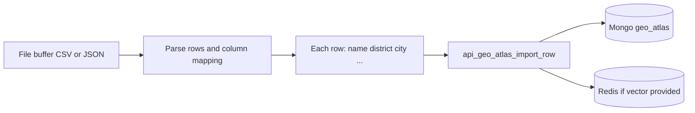

# GEO LEARNING MODULE (`geo_learning`)

> Implementation: `src/geo_learning.c`, `include/geo_learning.h`. Includes geo authority (§18) and conflict detector (§19).  
> Persisted data: MongoDB **`geo_atlas`** (`storage.h` / `storage.c`). **`[KNOWLEDGE_BASE]`** in prompts is **opt-in** via `api_options.inject_geo_knowledge` so the hot path does not block on Mongo.

**Canonical doc:** This file is the **single** architecture reference for **geo learning**, **`geo_atlas`**, and **`POST /api/geo/import`** (Python + c-lib). Do not duplicate long specs elsewhere — link here from `.cursor/engine.md`, `.cursor/elk.md`, `.cursor/auth_geo.md`, `streaming.md`, etc.

**Default tags / fallbacks:** **`.cursor/default_models.md`** (and **`.cursor/rules/default-models.mdc`**). **Config not set** → same macro/env chain as chat for embeds.

### Ollama model policy (chat + `/api/embed` unified)

Unless you set **`OLLAMA_EMBED_MODEL`**, **embedding** uses the **same resolution as chat** when the library passes a NULL model:

1. **`OLLAMA_EMBED_MODEL`** — optional; use only when the embed tag must differ from chat (e.g. a dedicated embedding-only pull). If unset, embed follows the **same** tag resolution as chat (see **`.cursor/default_models.md`**).
2. Else **first model name** from **`GET /api/tags`** (same idea as chat).
3. Else **`OLLAMA_MODEL`**.
4. Else compile-time **`OLLAMA_DEFAULT_MODEL`** in `include/ollama.h`.

c-lib: landmark / worker embeds use **`m4_embed_text`** + **`m4_embed_options_geo_env`** (**`include/embed.h`**, **`src/embed.c`**) — default Ollama path calls **`ollama_resolve_embed_model`** + **`ollama_embeddings`**; optional **`M4_EMBED_BACKEND=custom`** uses hash only. Python CSV import: **`geo_csv_import.embed_model_name()`** mirrors resolve order; last fallback **`m4_default_models.OLLAMA_DEFAULT_MODEL`**. Chat turn vectors use **`m4_embed_for_engine`** (same module).

**Requirement:** The chosen tag must support **`POST /api/embed`** in your Ollama build. If chat works but embed fails, either pull an embed-capable model or set **`OLLAMA_EMBED_MODEL`** to one.

---

## 1. Engine modes & when geo_learning runs

| `M4ENGINE_MODE_*` | Mongo | Redis | ELK host | `geo_learning_enabled` (see `api.c` → `engine_config_t`) | Notes |
|-------------------|-------|-------|----------|--------------------------------------------------------|--------|
| `ONLY_MEMORY` | — | — | — | **Off** | No `geo_atlas` persistence; worker not started. |
| `ONLY_MONGO` | ✓ | — | — | **Off** | Mongo without Redis: no background geo worker in current wiring. |
| `MONGO_REDIS` | ✓ | ✓ | — | **On** | Turn storage + RAG use Redis; **geo_learning worker starts** after `engine_init`. |
| `MONGO_REDIS_ELK` | ✓ | ✓ | ✓ | **On** | ELK host in `engine` config; **geo → ELK** is **observability-only** (§9), not implemented in c-lib yet. |

**Rule of thumb:** Treat **Mongo** as required for **authoritative `geo_atlas` documents**. **Chat RAG** uses Redis under `tenant_id` only; **geo vectors** use a separate lane `tenant|m4geo` (see §4). The table above is about **when the geo_learning worker runs**, not RAG.

---

## 2. Data flow — user input vs file buffer

Two ways data reaches **`geo_atlas`** (and optionally the **Redis geo index**). They share Mongo + dedup ideas but use **different entrypoints**.

### Case A — User input (interactive chat)

| Stage | What happens | Code / notes |
|-------|----------------|----------------|
| **Prompt read (optional)** | Prepend **[KNOWLEDGE_BASE]** from existing verified landmarks | `ctx_build_prompt` → `storage_geo_atlas_get_landmarks_for_prompt` **only if** `api_options_t.inject_geo_knowledge != 0`. **Default off** — no Mongo read on every message. |
| **Turn persistence** | Save turn to Mongo `bot.records` (and Redis vector for chat RAG when enabled) | `api_chat` → `engine_append_turn` → `storage_append_turn`. |
| **Enqueue for learning** | Copy `input` + `assistant` + ids into queue | `geo_learning_enqueue_turn` from `engine.c` **after** successful `storage_append_turn`, when `geo_learning_enabled`. **Runs for every persisted turn**, not only when the user asked about geography — the worker asks Ollama whether the *conversation* mentions any real-world places. **If `assistant` is empty** (e.g. stream parse miss), enqueue is **skipped** (nothing useful to extract). |
| **Worker** | Extract → composite skip → embed → vector dedup → insert | `geo_learning.c` `process_turn`: Ollama JSON extraction → **`storage_geo_atlas_exists_normalized_country`** (skip without embed) → **`m4_embed_text`** (see **`embed.h`**) → `storage_geo_redis_find_similar` / `storage_geo_atlas_find_similar` → integrity checks → **`storage_geo_atlas_insert_doc`** → **`storage_geo_redis_index_landmark`**. |
| **ELK audit (future)** | Optional non-blocking POST | §9 — not implemented in c-lib. |

```mermaid
flowchart TB
  subgraph read_kb [Optional prompt read]
    U1[User message] --> CP[ctx_build_prompt]
    CP -->|inject_geo on| KB["[KNOWLEDGE_BASE] Mongo geo_atlas read"]
  end
  subgraph learn [Learning write path]
    U2[User + assistant turn] --> EAT[engine_append_turn]
    EAT --> Q[geo_learning_enqueue_turn]
    Q --> PT[process_turn worker]
    PT --> MG[(Mongo geo_atlas)]
    PT --> RG[(Redis tenant|m4geo)]
  end
```

**Note:** `geo_learning_enqueue_turn` is **not** used for user-only text without a completed assistant reply in the same turn payload.

---

### Case B — Input from file buffer (bulk import)

| Stage | What happens | Code / notes |
|-------|----------------|----------------|
| **Source** | CSV / JSON **buffer** (upload, CLI, in-app paste) | Parsed by **host** or **python_ai** `POST /api/geo/import` (see §5 bulk row). **Does not** pass through `geo_learning_enqueue_turn`. |
| **Per row** | Map columns → fields → optional vector | **`api_geo_atlas_import_row`** (`api.h`) → `storage_geo_atlas_insert_doc` (+ Redis geo index when `vector` / `vector_dim` set). |
| **Dedup** | Same thresholds as worker when embeddings present | **`api_geo_atlas_import_row`** does **not** run dedup — it inserts then Redis-indexes if `vector` is set. For parity with Case A, the **caller** (e.g. Python import) should call **`storage_geo_redis_find_similar`** / **`storage_geo_atlas_find_similar`** before insert, or accept possible duplicates. |
| **No Ollama extract** | Structured rows: **no** `process_turn` JSON extraction | Unlike Case A, there is no “hidden” prompt to list places from dialogue — unless the app builds that itself. |



**When to use which:** **Case A** — learn from real chat. **Case B** — seed lists, migrations, curated POI CSVs. Both can populate the same collection so **[KNOWLEDGE_BASE]** (Case A read path) eventually sees **Case B** rows if they are not `pending_verification`.

---

## 3. Trigger (async, non-blocking) — **implemented**

| Item | Detail |
|------|--------|
| **When** | After `engine_append_turn` succeeds and `geo_learning_enabled`, `geo_learning_enqueue_turn(...)` is called (`engine.c`). |
| **How** | Dedicated **pthread** in `geo_learning.c` (`worker_fn`); **must not** block `api_chat` / stream return. |
| **Input** | Copied: `tenant_id`, `user_id`, `input`, `assistant`, `timestamp` (bounded buffers). |

Queue: `GEO_QUEUE_CAP` (16); if full, new turns are **dropped** (logged).

---

## 4. Dedup layers — **implemented**

Order matters in **`process_turn`** (after JSON parse, **before** **`m4_embed_text`** for a candidate entity):

| Order | Layer | Function | Behavior |
|-------|-------|----------|----------|
| **1** | **Composite key** | `storage_geo_atlas_exists_normalized_country` | Same `tenant_id` + `name_normalized` + `country` → skip (no embed call). |
| **2** | **Redis (fast)** | `storage_geo_redis_find_similar` | Lane `"{tenant}\|m4geo"`; threshold `GEO_ATLAS_SIMILARITY_THRESHOLD` (0.9). |
| **3** | **Mongo (authoritative)** | `storage_geo_atlas_find_similar` | Vector cosine vs `geo_atlas` if Redis did not flag a duplicate. |
| **After insert** | **Index** | `storage_geo_redis_index_landmark` | `redis_set_vector_ttl(..., ttl=-1)` so geo vectors are **not** evicted like short-TTL chat cache. |

**Redis API details (`redis.h` / `redis.c`):** `redis_search_semantic` takes an explicit `min_score`. `redis_set_vector_ttl(..., ttl < 0)` = no expiry (permanent stub entries). Chat RAG still uses `REDIS_SEMANTIC_MIN_SCORE_DEFAULT` (0.85) and default TTL.

**If Redis is disconnected:** only Mongo dedup runs (unchanged).

---

## 5. Ingestion pipeline — **implemented (high level)**

| Step | Code / behavior |
|------|------------------|
| **Extract** | Ollama JSON array: `name`, `district`, `axis`, `category`, `city`, `region`, `country`, `landmarks`, `merged_into`, optional `admin_action`, `admin_detail` (see `process_turn` prompt; §13). |
| **Parse** | Split `},{` segments; `parse_one_entity` (naïve JSON substring). |
| **Embed** | **`m4_embed_text`** (`embed.c`) → `embed_vec`, `embed_dim`, `embed_model_id` (Ollama resolve or **`VECTOR_GEN_MODEL_ID`**). |
| **Dedup** | **(1)** `storage_geo_atlas_exists_normalized_country` → skip. **(2)** `storage_geo_redis_find_similar` if Redis up. **(3)** `storage_geo_atlas_find_similar` ≥ `GEO_ATLAS_SIMILARITY_THRESHOLD` → skip insert. |
| **Redis index** | After successful insert: `storage_geo_redis_index_landmark` (persistent TTL in stub). |
| **Normalize** | `normalize_name` (lowercase, spaces → `_`) — **not** libpostal yet. |
| **Integrity** | `storage_geo_atlas_seed_conflict`, `geo_verify_place_plausible` (YES/NO Ollama); `GEO_INTEGRITY_VERIFY=0` skips verify. |
| **Write** | `storage_geo_atlas_insert_doc` → Mongo; then **`storage_geo_redis_index_landmark`** when a vector was produced (same as Case A). |

**Bulk CSV (integrated app):** The **Python** server exposes **`POST /api/geo/import`** (`python_ai/server/app.py`): multipart CSV or JSON `csv_text`, optional **column mapping** JSON (logical field → your header names), Ollama **embeddings** per row when **`embed=1`** (or precomputed **`vector`** column as JSON array), implemented via c-lib **`api_geo_atlas_import_row`** → `storage_geo_atlas_insert_doc` (+ optional Redis geo index). See **`geo_csv_import.py`** (`embed_model_name()`). Optional env **`M4ENGINE_GEO_IMPORT_KEY`** + header **`X-Geo-Import-Key`**. Model for **`embed=1`** follows the **unified policy** in the banner above (same as chat + geo worker embeds).

**Not implemented in c-lib only:** libpostal, `geo_learn_from_buffer` inside C, difference scanner vs existing rows — backlog.

---

## 6. Consumption (inference / `api_chat`) — **implemented**

| Rule | Detail |
|------|--------|
| **Writes** | **geo_learning worker**, **`api_geo_atlas_import_row`** (bulk), and internal **`storage_geo_atlas_insert_doc`** paths. |
| **Reads** | **`inject_geo_knowledge`** → `storage_geo_atlas_get_landmarks_for_prompt` in `ctx_build_prompt`. Default **off**. |
| **Pending & merged** | Landmarks query uses **`$nin`** for **`pending_verification`** and **`merged`** so unverified and administratively merged rows do not appear in `[KNOWLEDGE_BASE]`. |

---

## 7. Integration points (files)

| Location | Role |
|----------|------|
| `include/geo_learning.h` | `geo_learning_init`, `enqueue_turn`, `shutdown`. |
| `src/geo_learning.c` | Worker, `process_turn`, extraction, embed, dedup, insert. |
| `src/engine.c` | `geo_learning_enabled` flag; `init` / `destroy`; `engine_append_turn` → enqueue. |
| `src/storage.c` | `geo_atlas` CRUD, `find_similar`, `get_landmarks_for_prompt`, indexes, **`storage_geo_atlas_migrate_legacy`**. |
| `src/api.c` | `inject_geo_knowledge`; `ctx_build_prompt` prepends `[KNOWLEDGE_BASE]` when opt-in; **`api_geo_atlas_import_row`**; legacy migration via `api_options_t.geo_migrate_legacy`. |
| `src/engine.c` | Optional **`GEO_ATLAS_MIGRATE_LEGACY=1`** after `storage_connect`. |

---

## 8. Data model (`geo_atlas`) & indexes

See `storage_geo_atlas_doc_t`, `STORAGE_GEO_*` in `storage.h`. Indexes created on Mongo connect (`storage_ensure_geo_atlas_index`). **Tenant isolation** + **`__global__`** seeds (seed conflict, trust scores) — behavior unchanged in code.

---

## 9. ELK — **observability** (design; not implemented in c-lib)

**Goal:** Ship **audit / metrics events** to Elasticsearch so ops can **observe** geo_learning in Kibana (growth, pending vs verified, per-tenant). This is **not** chat inference, **not** RAG, and **not** required for correctness (Mongo remains source of truth).

### 9.1 Status in this repo

- **`storage_elk_ingest()`** (`storage.c`) is still a **stub** for the main `ai_index` + `auto_lang_processor` pipeline (see `.cursor/elk.md`).
- **No** `curl`/HTTP call from **`geo_learning.c`** yet. The contract below is for the **integrated app** or a **follow-up PR** (e.g. `storage_geo_elk_observability_event()` wrapping libcurl).

### 9.2 Operational rules (OBSERVABLE)

| Rule | Requirement |
|------|-------------|
| **Async** | Fire-and-forget from the geo worker (or a side queue). **Never** `pthread_join` on ELK or block `api_chat` / stream. |
| **Non-critical** | On failure (timeout, 4xx/5xx, unreachable): **`fprintf(stderr, ...)`** once; **no** retries in the hot path; learning + Mongo already succeeded. |
| **Idempotency** | Events are **append-only audit**; duplicate POSTs are acceptable (use `@timestamp` + `event_id` in payload if dedupe needed downstream). |

### 9.3 Index & HTTP (suggested)

| Item | Suggestion |
|------|--------------|
| **Index** | `geo_atlas_audit` (or `m4-geo-audit` + ILM policy). Separate from **`ai_index`** so geo docs do not run through `auto_lang_processor` unless you want language tags on free text. |
| **Endpoint** | `POST https://{es_host}:{es_port}/geo_atlas_audit/_doc` (or Bulk API for batches). Use same **`es_host` / `es_port`** as `engine_config_t` / `api_options_t`. |
| **Pipeline** | **None** by default (structured JSON only). Optional: lightweight `geo_audit_pipeline` for `add_fields` (cluster name, env). |

### 9.4 Payload schema (minimal JSON)

Use **ECS-friendly** optional fields where useful; keep documents **small** (&lt; 2 KB).

```json
{
  "@timestamp": "2025-03-21T10:21:49.123Z",
  "event.action": "geo_atlas.insert",
  "event.dataset": "m4engine.geo_learning",
  "service.name": "m4engine",
  "tenant_id": "default",
  "geo.name": "Bến Thành",
  "geo.name_normalized": "bến_thành",
  "geo.verification_status": "verified",
  "geo.trust_score": 0.88,
  "geo.source": "user",
  "geo.embed_model_id": "<resolved embed tag; same as chat default unless OLLAMA_EMBED_MODEL set>"
}
```

**Optional extras:** `geo.district`, `geo.city`, `geo.seed_conflict` (bool), `trace.id` if you correlate with app traces.

### 9.5 Kibana (OBSERVABLE) — what to build

- **Lens / TSVB:** Count of `event.action=geo_atlas.insert` over time (growth).
- **Breakdown:** `geo.verification_status` (pie: verified vs `pending_verification`).
- **Table:** Latest rows with `geo.name`, `tenant_id`, `@timestamp` for manual review of pending entries.
- **Alert (optional):** Spike in `pending_verification` or drop in `trust_score` (if you add numeric rules in Watcher).

### 9.6 Out of scope (do not conflate)

| Topic | Note |
|-------|------|
| **Semantic search / kNN in ES** | Separate analytics project: replicate vectors from Mongo via CDC/Logstash; **not** the observability POST above. |
| **Blocking chat** | Forbidden: ELK must never sit on the `api_chat` critical path. |

---

## 10. Backlog / aspirational (not in c-lib today)

Ideas previously sketched elsewhere — **not** implemented unless tracked in issues:

- libpostal normalization; bulk CSV/JSON `GeoAnchor` ingest.
- **Difference scanner** on contradicting user vs atlas (trust updates).
- **`[VERIFIED_KNOWLEDGE]`** block format distinct from current `[KNOWLEDGE_BASE]` text.
- `pthread_detach` vs current **joinable** worker (implementation detail; current design uses join on shutdown).

---

## 11. Environment knobs (quick reference)

| Variable | Effect |
|----------|--------|
| `GEO_INTEGRITY_VERIFY=0` | Skip `geo_verify_place_plausible` (treat as YES). |
| `OLLAMA_EMBED_MODEL` | **Optional:** preferred embed tag for Ollama path inside **`m4_embed_*`**. If unset, same resolve chain as chat (see banner + **`.cursor/default_models.md`**). |
| `M4_EMBED_BACKEND` | **Geo worker:** `custom` / `0` → hash-only embed; unset or `ollama` / `1` → Ollama (default). |
| `M4_EMBED_FALLBACK_CUSTOM` | **1/true/yes:** if Ollama embed fails, fall back to custom hash (watch mixed dims in Redis geo index). |
| `OLLAMA_MODEL` | Chat **`/api/generate`** when the code passes a NULL model; also used for **`/api/embed`** when **`OLLAMA_EMBED_MODEL`** unset and `/api/tags` fails or is empty. |
| `GEO_ATLAS_MIGRATE_LEGACY=1` | On **`engine_init`**, run **`storage_geo_atlas_migrate_legacy`** once (§17). Remove or unset after successful migration. |

---

## 12. Implementation checklist (Redis-accelerated dedup)

- [x] Tenant lane `tenant|m4geo` (see `storage_geo_redis_lane` in `storage.c`).
- [x] `process_turn`: composite existence → Redis find → Mongo find → insert → Redis index (see `geo_learning.c`, §4–§5).
- [x] Threshold: both paths use `GEO_ATLAS_SIMILARITY_THRESHOLD` (0.9).
- [ ] Optional: include `embed_model_id` in lane or payload when mixing embedding models.
- [ ] Production: replace in-memory L2 stub with Hiredis + RediSearch KNN; keep the same storage facade signatures.
- [ ] **ELK observability:** implement async `POST` to `geo_atlas_audit` (or shared `storage_elk_*` helper) per **§9** after successful Mongo insert — non-blocking, no retry.

Keep this file in sync when changing `geo_learning.c`, `embed.c`, `geo_csv_import.embed_model_name`, or `storage_geo_atlas_*`. **Geo Mongo docs** now include **`embed_schema`**, **`vector_dim`**, **`embed_family`** (same semantics as chat **`metadata`** — **`.cursor/embed_migration.md`**).

---

## 13. Geo-data integrity — schema & standardization (**implemented in c-lib**)

### 13.1 Canonical `geo_atlas` fields (Mongo)

| Field | Role |
|-------|------|
| `name` | Official display name (UTF-8). |
| `name_normalized` | Lowercase, underscores for spaces; **accent folding** is not fully implemented yet (same helper as before — backlog). |
| `category` | e.g. Province, District, Landmark. |
| `district` | Administrative center / capital when applicable. |
| `axis` | Routes / navigation infra (e.g. QL…). **Not** macro compass alone. |
| `city` | City or wider locality (legacy LLM key). |
| `region` | Macro geography (e.g. Mekong Delta, South). |
| `country` | **Required in schema**; c-lib defaults to **`Vietnam`** when the extractor leaves it empty. Stored on every insert. |
| `landmarks` | Optional comma-separated POI text from extraction. |
| `merged_into` | Optional **normalized** administrative-merge target (e.g. after 2025–26 re-org). |
| `admin_action` | Optional short tag from extraction: e.g. `merge`, `split`, `expand`, `upgrade`, `rename`, `alias`, `status` (§16 — stored only; prompt guard rules are backlog). |
| `admin_detail` | Optional UTF-8 note (e.g. target name, old name); avoid embedded double-quotes in model output. |
| `verification_status` | Includes **`merged`** (`STORAGE_GEO_STATUS_MERGED`) for merged rows — excluded from **[KNOWLEDGE_BASE]** with `pending_verification`. |
| `source` | Includes **`manual_seed_cleanup`** (`STORAGE_GEO_SOURCE_MANUAL_SEED_CLEANUP`) for curated imports (set by host/importer, not auto from chat learning). |

**Index:** `tenant_id` + `name_normalized` + `country` (composite hint for dedup).

### 13.2 Ingestion cleanup (`geo_learning.c` → `process_turn`)

| Rule | Behaviour |
|------|-----------|
| **Axis vs region** | If `axis` is only **`South`**, **`North`**, or **`Central`** (ASCII, case-insensitive), value is **moved to `region`** and `axis` cleared. |
| **District = name** | Logs a **redundant** warning (does not block insert). |
| **Country** | Default **`Vietnam`**. If LLM emits another country → **`pending_verification`** (trust ~0.42) unless `merged_into` forces **`merged`**. |
| **Dedup** | Before embedding: **`storage_geo_atlas_exists_normalized_country`** (`tenant_id` + `name_normalized` + `country`). Then existing Redis/Mongo vector similarity. |
| **Merge** | If JSON **`merged_into`** is set → **`verification_status: merged`**, `trust_score: 1.0`, BSON **`merged_into`**, and **`geo_authority_upsert_learned(..., merged_into_key)`** for `conflict_detector.c`. |

### 13.3 Global hierarchy & validation (partial)

- **Default country** is enforced in storage for inserts (`country` field defaults to Vietnam).
- **Full geofencing** (“Saigon tenant”, blocking wrong region/country in prompts) is **not** implemented in c-lib — host/app layer. Non-Vietnam from the extractor is downgraded to **pending**.
- **`parent_id` → Mongo `_id` of parent** for merges: **not** implemented; **`merged_into`** carries the **normalized name** only (resolve `_id` in app or a future migration).

### 13.4 Metadata & trust (reference)

| Source | Use |
|--------|-----|
| `manual_seed_cleanup` | Set on **manual** CSV/seed fixes (not auto from `geo_learning` worker). |
| Trust **1.0** | Merged rows when `merged_into` is present; curated seeds by convention. |
| User-learned | Existing paths (0.35–0.88) unchanged except country / merge branches above. |

---

## 14. Cross-links

- **Prompt time:** `.cursor/ptomp.md` — `[SYSTEM_TIME]`; not duplicated here.

---

## 15. Implementation checklist (schema + integrity)

- [x] Extended `storage_geo_atlas_doc_t` + BSON (`region`, `country`, `landmarks`, `merged_into`, `admin_action`, `admin_detail`).
- [x] `STORAGE_GEO_STATUS_MERGED`, `STORAGE_GEO_SOURCE_MANUAL_SEED_CLEANUP`.
- [x] Composite existence check + index `{ tenant_id, name_normalized, country }`.
- [x] `geo_learning` extraction prompt + parser extended; axis/region cleanup; country default; merged path + authority upsert.
- [x] `[KNOWLEDGE_BASE]` excludes **merged** rows (`$nin` pending + merged).
- [ ] Accent-free `name_normalized` (libpostal / ICU-class normalizer).
- [ ] `parent_id` as Mongo `ObjectId` reference for merges.
- [ ] Deep region consistency checks (e.g. “Kiên Giang in North”) — policy layer or future rules engine.
- [x] Legacy **`geo_atlas`** backfill API + optional startup env (§17).


## 16. GEO-DYNAMICS (administrative change metadata)

This section ties **design notes** to what c-lib actually does today.

### 16.1 Implemented in c-lib

| Piece | Behavior |
|-------|----------|
| **`merged_into` + `merged` status** | Extractor can set `merged_into`; row is stored with **`verification_status: merged`**, **`trust_score: 1.0`**, and **`geo_authority_upsert_learned`** receives the normalized merge target (see §13.2, `auth_geo.md`). |
| **`admin_action` / `admin_detail`** | Optional strings from the same JSON array as other entity fields; persisted on **`geo_atlas`** when non-empty. Intended for ops/analytics and future prompt rules — **no** automatic rewrite of `[KNOWLEDGE_BASE]` or system prompt from these fields yet. |
| **Post-chat conflict** | **`conflict_detector`** + authority (see `conflict_detector.md`) — separate from the GEO-DYNAMICS “guard” bullets below. |

### 16.2 Backlog (not wired in `ctx_build_prompt` / worker today)

- **Rich `recent_change` JSON** (nested `to` / `from` / arrays) — today we only store flat **`admin_action`** + **`admin_detail`** plus **`merged_into`** for merges.
- **Per-action prompt injection** (“if expand, state …”) — spec only; implement in host or when `inject_geo_knowledge` is extended to read `admin_*`.
- **`language_context`** / dialect maps — not in schema.
- **Reject-on-abolished-name** as a dedicated rule — overlap with **`conflict_detector`** / authority; unify in product layer if needed.

### 16.3 Reference action vocabulary (for models & importers)

When filling **`admin_action`**, prefer one of: **`merge`**, **`split`**, **`expand`**, **`upgrade`**, **`rename`**, **`alias`**, **`status`**. Use **`admin_detail`** for a short human-readable note (target name, old name, etc.). **`merged_into`** remains the canonical normalized target for **merge** outcomes that should drive **`merged`** status and authority.

---

## 17. Legacy `geo_atlas` migration (flat schema — **implemented**)

c-lib uses a **flat** Mongo document: **`merged_into`**, **`admin_action`**, **`admin_detail`**, etc. Do **not** `$unset` **`merged_into`** or move merge semantics into a nested **`recent_change`** object unless you also change **`storage_geo_atlas_insert_doc`**, **`geo_learning`**, **`geo_authority_upsert_learned`**, and **`conflict_detector`** expectations. A nested **`recent_change`** blob remains **backlog** (see §16.2).

### 17.1 What “old” documents look like

| Legacy situation | Why it matters |
|------------------|----------------|
| No **`country`** (missing, `null`, or `""`) | Composite dedup **`storage_geo_atlas_exists_normalized_country`** and the **`{ tenant_id, name_normalized, country }`** index assume **`country`**; new code defaults to **Vietnam** on insert. |
| **`merged_into`** set but **`verification_status`** ≠ **`merged`** | **`[KNOWLEDGE_BASE]`** excludes **`merged`**; old rows might still show as **verified** while carrying a merge target — inconsistent with §13. |
| No **`admin_action`** | Harmless; optional backfill for analytics. |

Heuristic rules like “**Thành phố** in **name** ⇒ **expand**” or “normalized vs display **name** ⇒ **rename**” are **not** applied automatically (too error-prone); curate those via CSV import or a custom script if needed.

### 17.2 Implemented backfill (`storage_geo_atlas_migrate_legacy`)

Runs **two** `update_many` operations on **`bot.geo_atlas`**:

1. **`country`**: `{ $or: [ missing, null, "" ] }` → **`$set: { country: "Vietnam" }`**.
2. **`merged_into`**: non-empty string, **`verification_status` ≠ `merged`** → **`$set`**: **`verification_status: merged`**, **`trust_score: 1.0`**, **`admin_action: merge`**.

**Idempotent:** Re-running is safe (already-migrated docs stop matching).

**Call paths:**

- **Config:** `api_options_t.geo_migrate_legacy = 1` at `api_create` (runs automatically at init).
- **Startup:** set **`GEO_ATLAS_MIGRATE_LEGACY=1`** for one process start (handled in **`engine_init`** immediately after **`storage_connect`**). Unset afterward so every deploy does not re-scan.

**Not done by this migration:** Redis geo lane re-indexing (vectors unchanged); accent normalization; nested **`recent_change`**.

### 17.3 After migration — authority / ops

- **`geo_authority`** L1 cache is **not** auto-filled from Mongo. If you rely on **`merged_into`** pairs for **`conflict_detector`**, reload authority data via `api_options_t.geo_authority_csv_path` at `api_create`.
- Spot-check Mongo (e.g. a place that merged into another): expect **`merged_into`**, **`verification_status: merged`**, and optional **`admin_action: merge`** — **not** a removed flat field.

---

## 18. Geo Authority (in-memory L1 cache)

> Merged from `auth_geo.md`. Implementation: `include/geo_authority.h`, `src/geo_authority.c`.

### 18.1 Objective
- **Reduce hallucinated placenames**: Cross-check assistant text against an in-memory **authority cache** (hash table, max **15,000** entries).
- **No Mongo I/O on the hot path**: Lookups are RAM-only (`pthread_rwlock_t`).
- **Dynamic update**: Hot-load extra names from a CSV file via `api_options_t.geo_authority_csv_path` at `api_create`.

### 18.2 Memory architecture
| Piece | Location |
|-------|-----------|
| String hash map (chaining) | `include/utils.h`, `src/utils.c` — `m4_ht_*` |
| Entries + rwlock + seed + audit | `include/geo_authority.h`, `src/geo_authority.c` |
| Key | `name_normalized`: lowercase A-Z, spaces → `_` (UTF-8 bytes preserved). |
| Value | `geo_authority_entry_t`: `display_name`, `parent_id` (reserved, default `-1`), `trust_score` (`1.0` seed). |

### 18.3 Prompt interceptor (current behaviour)
- **Pre-inference**: If `api_options_t.geo_authority` is non-zero, `ctx_build_prompt` appends **`[GEO_AUTHORITY_HINT]`** with seeded provincial display names.
- **Post-inference (guard, observability-first)**: **`geo_authority_audit_response_text`** scans tokens (length >= 4) and logs `[GEO_AUTH]` for tokens **not** in the cache. Does **not** rewrite the reply yet.

### 18.4 Ingestion & sync
| Mechanism | Status |
|-----------|--------|
| **CSV at init** | `api_options_t.geo_authority_csv_path` — loaded at `api_create` via `geo_authority_load_buffer`. |
| **geo_learning** | After `storage_geo_atlas_insert_doc` with verified/merged status, `geo_authority_upsert_learned` updates L1. |
| **Startup Mongo mirror** | Not implemented — optional follow-up. |

### 18.5 Engine wiring
- **`engine_config_t.geo_authority_enabled`** — from `api_options_t.geo_authority`.
- **`engine_init`**: `geo_authority_init` (seed provinces). **`engine_destroy`**: `geo_authority_shutdown`.
- **`api_chat`**: audit on final assistant text (including Redis short-circuit paths).

---

## 19. Conflict Detector (intra-prompt logic guard)

> Merged from `conflict_detector.md`. Implementation: `include/conflict_detector.h`, `src/conflict_detector.c`.

### 19.1 Objective
- **Internal consistency**: Detect self-contradiction in assistant lists (e.g. wrong province count vs user-stated expectation; merged provinces listed separately).
- **Post-inference**: Runs on the **full** assistant reply **before** `engine_append_turn`.

### 19.2 Logic
| Step | Behaviour |
|------|-----------|
| **Entity counting** | Parse numbered lines (`1.` / `1)`) in assistant text; split items by `,` / `;`; normalize keys; unique count. If user message has a number 20-99 near keywords (`province`, `tinh`, `tỉnh`), treat as expected count. If expected >= 0 and unique != expected → `LOGIC_CONFLICT`. |
| **Merger validation** | For each unique key, `geo_authority_lookup`. If entry has `merged_into_key` and both key + parent appear → merger CONFLICT. |
| **Action** | Append `[LOGIC_CONFLICT] Note: ...` (Vietnamese) to assistant buffer when `geo_authority` enabled. |
| **Persistence** | `engine_append_turn` sets `metadata.has_logic_conflict` (bool) on Mongo when `USE_MONGOC=1`. |

### 19.3 Merger column (CSV)
- CSV loaded via `api_options_t.geo_authority_csv_path`: optional **second column** = merged-into parent (normalized).
- Seed provinces have no `merged_into` unless CSV provides it.

### 19.4 Files
- `include/conflict_detector.h`, `src/conflict_detector.c` — `conflict_detector_analyze`.
- Wired from `api.c` via `run_geo_authority_post_chat` when **`geo_authority`** is enabled.

