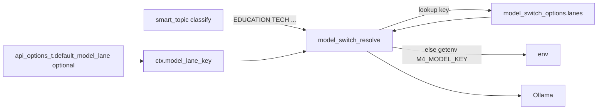

# Model switch (`model_switch`)

Runtime resolution of **Ollama chat model** + optional **inject** text from a **dynamic table** (`lanes[]`: string key → model, inject) plus **smart_topic** intent. No fixed enum of env vars in code beyond the generic pattern `M4_MODEL_<KEY>`.

**Defaults / no drift:** Compile-time chat fallback is **`OLLAMA_DEFAULT_MODEL`** in `include/ollama.h`. Full checklist and Python mirror: **`.cursor/default_models.md`**. When a lane **`model`** is **`""`**, resolution uses env + that macro (§1 step 5).

**Future cloud router (not implemented):** Empty lane **`model`** is the natural case to drive a **hosted pool** (per-tier `model_id` + limits) while still using **`inject`** from this resolver. Spec: **`.cursor/models/ai_agent.md`** §5–8. Doc map: **`.cursor/model_routing_index.md`**. Until wired, the diagram below ends at **Ollama** only.

---

## 1. Data flow



1. **Session override** — `api_options_t.default_model_lane(ctx, "EDUCATION")` or `api_options_t.default_model_lane = M4_API_MODEL_LANE_EDUCATION`. **NULL / ""** clears override → treat as **DEFAULT** (merge with smart_topic if flag set).
2. **smart_topic** (if enabled) — one micro-call → **intent** `TECH` / `CHAT` / `EDUCATION` / `BUSINESS` / `DEFAULT` + temperature.
3. **Effective key** — If session is DEFAULT (empty or literal `"DEFAULT"`) **and** `MODEL_SWITCH_FLAG_MERGE_SMART_TOPIC_INTENT`: use intent’s canonical key (`smart_topic_intent_lane_key`). Else use session key.
4. **Lookup** — For that key, scan **`options.lanes[]`** (case-insensitive `key`). Use row’s `model` / `inject` if non-empty.
5. **Fallback** — Empty model in row → **`getenv("M4_MODEL_<KEY>")`** (KEY uppercased, `[A-Z0-9_]`). Then `fallback_model`, `OLLAMA_MODEL`, **`OLLAMA_DEFAULT_MODEL`**. Inject: `M4_INJECT_<KEY>`, then `M4_INJECT_DEFAULT` for key `DEFAULT`.

---

## 2. App config example (C)

**Recommended (no hardcoded tag):** use **`""`** for `model` so each lane inherits **`M4_MODEL_<KEY>`** / **`OLLAMA_MODEL`** / **`OLLAMA_DEFAULT_MODEL`** (see **`.cursor/default_models.md`**). Only put a **literal tag** in a row when that lane must always use a specific Ollama name.

```c
static const model_switch_lane_entry_t g_lanes[] = {
    { "EDUCATION", "", "Be clear and pedagogical." },
    { "BUSINESS",  "", "Be concise and professional." },
    { "TECH",      "", NULL },
    { "CHAT",      "", NULL },
    { "DEFAULT",   "", NULL },
};

static const model_switch_options_t g_ms = {
    .lanes = g_lanes,
    .lane_count = sizeof(g_lanes) / sizeof(g_lanes[0]),
    .fallback_model = NULL,  /* or set a shared fallback string */
    .flags = MODEL_SWITCH_FLAG_MERGE_SMART_TOPIC_INTENT,
    .adaptive_profile_id = NULL,
};
/* api_options_t.model_switch_opts = &g_ms; */
```

Optional: set **`fallback_model`** to one explicit tag, or use **`M4_MODEL_TECH`** etc. in the environment instead of embedding names in source.

---

## 3. API (`model_switch.h`)

| Symbol | Role |
|--------|------|
| `model_switch_lane_entry_t` | `key`, `model`, `inject` |
| `model_switch_options_t` | `lanes`, `lane_count`, `fallback_model`, `flags`, `adaptive_profile_id` |
| `model_switch_profile_t` | Out: `model`, `inject`, **`lane_key`** |
| `model_switch_resolve(opts, session_lane_key, st_intent, out)` | Core resolver |
| `smart_topic_intent_lane_key(st)` | Intent → `"TECH"` / `"EDUCATION"` / … |

---

## 4. smart_topic labels

Micro-prompt asks for **one word**: `TECH`, `CHAT`, `EDUCATION`, `BUSINESS`, or `DEFAULT`. Custom lane keys (e.g. `STUDY`) require either **session** `api_options_t.default_model_lane(ctx, "STUDY")` or a **future** extension to build the micro-prompt from your lane list.

---

## 5. Flags & future

| Flag | Role |
|------|------|
| `MODEL_SWITCH_FLAG_MERGE_SMART_TOPIC_INTENT` | DEFAULT session → use intent key for table lookup |
| `MODEL_SWITCH_FLAG_ADAPTIVE_RESERVED` | Placeholder for scored / dynamic policy |

**Future (not implemented):** Multi-provider **cloud chat** with per-provider **rate limits**, **rotation**, and **local Ollama** as final fallback — **`.cursor/models/ai_agent.md`**.

---

## 6. Cross-links

- **smart_topic**: `.cursor/smart_topic_ai_switch.md` — temperatures per intent.
- **Engine**: `engine_config_t.model_switch_opts` from `api_options_t`.

## 7. Migration (older struct layout)

Earlier builds used fixed fields (`model_education`, …). Replace each with a **`model_switch_lane_entry_t`**: `{ "EDUCATION", "<model or \"\">", "<inject?>" }`, etc. Empty **`<model>`** → fallback chain (**`.cursor/default_models.md`**).

## 8. Testing

| Command | What it checks |
|---------|----------------|
| `make test-model-switch-flow` | **`model_switch_resolve`** only: `lanes[]`, merge flag, session override, `M4_MODEL_*` getenv. **No Ollama.** Source: `tests/model_switch_flow_test.c`. |

**End-to-end (user input → micro intent → main model):**

1. Run Ollama with the models you reference in env / lane rows / **`OLLAMA_DEFAULT_MODEL`** (and smart_topic TINY if enabled).
2. Build options: `smart_topic_options_t` with `enable = true`, `model_switch_options_t` with `lanes[]` + **`MODEL_SWITCH_FLAG_MERGE_SMART_TOPIC_INTENT`**.
3. `api_create` with both opt pointers; optional `api_options_t.default_model_lane(ctx, NULL)` to clear session lane.
4. Send an education-style **`api_chat`** message; stderr from smart_topic / Ollama shows activity; confirm the **main** request uses the model from the **EDUCATION** row (Ollama logs or `OLLAMA_DEBUG`).
5. Force lane: `api_options_t.default_model_lane(ctx, "TECH")` then chat — should use **TECH** row regardless of message tone.

`make test-api-source-redis` exercises **`api_chat`** when Ollama is up (see that Makefile target).

---

## Cloud LLM pool + Ollama fallback

> [DESIGN - Not enabled] Merged from `models/ai_agent.md`. Implementation: `src/ai_agent.c`, `include/ai_agent.h`.

**Goal:** Prefer hosted free-tier chat APIs when available, with per-provider rate limits and rotation; fall back to local Ollama when all cloud paths are blocked.

### Traffic order
| Order | Role |
|-------|------|
| **1 — Cloud pool** | Primary chat completions (Groq, Cerebras, Gemini) |
| **2 — Rate guard** | Per-provider RPM/TPM/daily caps; skip blocked backend |
| **3 — Ollama** | Final fallback when all pool members are rate-limited or unhealthy |

### Cycling policies
- Round-robin, weighted round-robin, or LRU among eligible backends
- On HTTP 429: read `Retry-After`, mark backend cooldown, try next
- When all exhausted: fall through to Ollama

### Status
- `ai_agent_complete_chat` in `src/ai_agent.c` implements the try-order with env-based keys
- Full quota tracking and proactive rate limiting: **not yet implemented**
- Concrete provider order and env contract: `.cursor/models/ai_agent.md`
