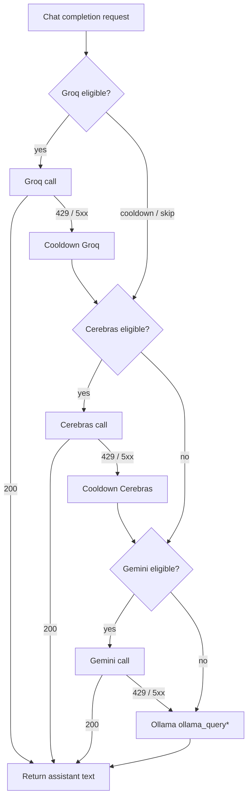

# AI Agent — LLM routing module

Implementation: `include/ai_agent.h`, `src/ai_agent.c`.

## Architecture

```
┌─────────────────────────────────────────────────────────────────────┐
│                          api_chat(ctx, ...)                         │
│                     (public API — sync or stream)                   │
└──────────────────────────────┬──────────────────────────────────────┘
                               │
                   ┌───────────▼───────────────┐
                   │      model_switch          │
                   │  Resolve: lane → model +   │
                   │  temperature + api_url +   │
                   │  api_key + inject          │
                   └───────────┬───────────────┘
                               │
                   ┌───────────▼───────────────┐
                   │  ctx_build_prompt_parts    │
                   │  → ai_agent_prompt_t       │
                   │    system: persona+time    │
                   │    history[]: role+content │
                   │    user: current message   │
                   └───────────┬───────────────┘
                               │
         ┌─────────────────────▼─────────────────────────┐
         │            ai_agent_complete_chat              │
         │         (internal LLM router)                  │
         └──┬──────────┬───────────┬──────────┬──────────┘
            │          │           │          │
   ┌────────▼────┐ ┌───▼─────┐ ┌──▼────┐ ┌───▼──────┐
   │ Lane direct │ │  Groq   │ │Cere-  │ │ Gemini   │
   │ (api_url +  │ │         │ │bras   │ │          │
   │  api_key)   │ │         │ │       │ │          │
   └──────┬──────┘ └────┬────┘ └───┬───┘ └────┬─────┘
          │             │          │           │
          │    ┌────────▼──────────▼───────────▼──────┐
          │    │  OpenAI-compatible messages[] format  │
          │    │  {"role":"system"}, {"role":"user"},  │
          │    │  {"role":"assistant"}, ...            │
          │    └──────────────────────────────────────┘
          │
          │    If all cloud fail ──────┐
          │                            │
          └────────────────────────────▼──────────────┐
                                   ┌──────────────────▼──┐
                                   │      Ollama         │
                                   │  (final fallback)   │
                                   │  Single prompt blob │
                                   │  ollama_query*      │
                                   └─────────────────────┘
```

## Data Flow

```
1. api_chat called
   │
2. model_switch_resolve(lane_key, smart_topic_intent)
   ├── Lane found with api_url? → direct endpoint config
   ├── Lane found with model only? → model preference for Ollama
   └── No lane / DEFAULT → use cloud pool defaults
   │
3. ctx_build_prompt_parts → ai_agent_prompt_t
   ├── system:  topic + [KNOWLEDGE_BASE] + [GEO_AUTHORITY_HINT]
   │            + [SYSTEM_TIME] + persona + instructions
   ├── history[]: each past message as {role, content}
   └── user:    current user message
   │
4. ctx_build_prompt → flat blob (for Ollama fallback)
   │
5. ai_agent_complete_chat(prompt_parts, flat_blob, ...)
   │
   ├─► Priority 1: Lane has api_url + api_key
   │   └── try_openai_chat_structured(url, key, model, prompt_parts)
   │       ├── Success → return SOURCE_CLOUD
   │       └── Failed → fall through to cloud pool
   │
   ├─► Priority 2: Cloud pool (M4_CHAT_BACKEND != ollama)
   │   └── For each tier in M4_CLOUD_TRY_ORDER (default: groq,cerebras,gemini):
   │       ├── Groq:     try_openai_chat_structured (messages[])
   │       ├── Cerebras: try_openai_chat_structured (messages[])
   │       └── Gemini:   try_gemini (flat prompt — TODO: structured)
   │       ├── First 200 OK → return SOURCE_CLOUD
   │       └── 429/5xx → cooldown, try next tier
   │
   ├─► Priority 3: M4_CHAT_BACKEND=ollama only
   │   └── ollama_query*(flat_blob) → return SOURCE_OLLAMA
   │
   └─► Priority 4: Ollama final fallback (cloud all failed)
       └── ollama_query*(flat_blob, model_preference) → return SOURCE_OLLAMA
```

## Prompt Format Per Wire Type

| Wire type | Provider(s) | Format sent | Source |
|-----------|-------------|-------------|--------|
| `OPENAI_CHAT` (1) | Groq, Cerebras, Lane endpoints | `messages[]` with `system`, `user`, `assistant` roles | `ai_agent_prompt_t` → `build_openai_messages_body` |
| `GEMINI` (2) | Google Gemini | Single text in `contents[].parts[]` (TODO: structured) | Flat blob escaped |
| `OLLAMA` (3) | Local Ollama | Single prompt string with `User:`/`Assistant:` labels | `ctx_build_prompt` flat blob |
| `REDIS_RAG` (4) | Redis cache | No LLM call — cached reply returned | N/A |

## Stream Behavior

| Condition | What happens |
|-----------|-------------|
| Lane has `api_url` OR cloud keys set | `ai_agent_complete_chat` sync → full reply delivered via callback (synthetic stream) |
| `ai_agent` cloud fails, falls through | Real token-by-token via `ollama_query_stream` |
| `M4_CHAT_BACKEND=ollama` | Real token-by-token via `ollama_query_stream` |
| Redis RAG hit | Cached reply delivered via callback (no LLM) |

## Quick Reference

| Item | Detail |
|------|--------|
| **Files** | `include/ai_agent.h`, `src/ai_agent.c` |
| **Called by** | `api_chat` in `src/api.c` (both sync and stream paths) |
| **Calls** | `try_openai_chat_structured` (Groq/Cerebras), `try_gemini`, `ollama_query*` via `ollama.c` |
| **Env: backend** | `M4_CHAT_BACKEND`: unset/`cloud_then_ollama` (default), `ollama`, `cloud` |
| **Env: try order** | `M4_CLOUD_TRY_ORDER`: `groq,cerebras,gemini` (default) |
| **Env: keys** | `GROQ_API_KEY`, `CEREBRAS_API_KEY`, `GEMINI_API_KEY` |
| **Env: models** | `M4_CLOUD_GROQ_MODEL`, `M4_CLOUD_CEREBRAS_MODEL`, `M4_CLOUD_GEMINI_MODEL` |
| **Env: debug** | `M4_LOG_CLOUD_LLM=1` (stderr diagnostics) |
| **Lane override** | `model_switch_lane_entry_t.api_url` + `.api_key` → direct endpoint, no pool |

---

> Below: detailed specs (try order, config, troubleshooting, policy). Sections §1–§15 from original design doc.

---

**Explicit / “initial” model from the user:** When the user (or config) **names a real model**—e.g. a **non-empty** ``model_switch`` lane row, **`M4_MODEL_<KEY>`**, or **`OLLAMA_MODEL`** resolving to a concrete tag—the stack should use **that** model for the turn, **not** the generic free-tier pool. Today: resolved **Ollama tag** → **local Ollama only** for that turn (**`ai_agent_complete_chat`** + §5.1). **If the user (or API client) supplies an explicit hosted model + provider**, same idea: **only** that backend (see §8a); no silent hop to another vendor without consent. Env **`M4_CLOUD_*_MODEL`** defaults apply only when **no** such pin exists.

---

## 1. Relation to `.cursor/rules` and this `models/` folder

| Piece | Role |
|--------|------|
| **`.cursor/rules/models-folder.mdc`** | For **model-dependent** behavior, open **`.cursor/models/{slug}.rule.md`** (or `default.rule.md`). |
| **`.cursor/models/*.rule.md`** | **Prompt quirks, risk, capabilities** keyed by **resolved model id** (Ollama tags today; hosted ids when you add them). |
| **Hosted models** | Cloud **model id** strings differ (Groq/Cerebras OpenAI-style, Gemini native). Add **parallel** `*.rule.md` via `scripts/model_rule_slug.py` if prompts differ by host. |
| **`.cursor/rules/default-models.mdc`** | **No drift** on **`OLLAMA_DEFAULT_MODEL`** / embed defaults — **`.cursor/default_models.md`**. |

**Embeddings:** Keep **vector + metadata** per **`.cursor/rules/embed-vector-metadata.mdc`** and **`.cursor/embed_migration.md`**. Chat cloud routing does **not** change embed provenance unless you explicitly add a cloud embed path.

**Prompts & API types:** Backend **`groq` / `cerebras` / `gemini` / `ollama`**, OpenAI-compatible vs Gemini wire format, and **when to change `ptomp.md` vs per-model rules** — **`ai_agent.md`**.

---

## 2. Free-tier landscape (chat) — verify at source

Limits change often. Confirm **RPM / RPD / TPM** on each vendor’s docs before relying on numbers in automation.

| Provider | Role in typical setups | Verify |
|----------|------------------------|--------|
| **Groq** | High throughput on free tier; **daily** and **per-model** caps; OpenAI-compatible chat. | [Groq rate limits](https://console.groq.com/docs/rate-limits) |
| **Cerebras** | OpenAI-compatible API; free tier and RPM/TPM vary by account/plan — treat limits as **configurable**, not hardcoded. | [Cerebras API docs](https://inference-docs.cerebras.ai/) |
| **Google Gemini API** | Model-specific RPM/RPD; shared TPM-style pools; limits have changed over time. | [Gemini rate limits](https://ai.google.dev/gemini-api/docs/rate-limits) |
| **OpenRouter / others** | Optional extra pool members; free routes often **very** low daily caps. | Vendor docs |

**Operational reality:** Prefer **quota guards + reactive 429 failover** (see **`.cursor/models/ai_agent.md` §2**). For implementation sequencing, see **`ai_agent.md`**.

---

## 3. Fallback and resolution (c-lib)

**C library `api_chat`:** After Redis RAG short-circuit (if any), builds the prompt (**`model_switch`** inject + Ollama tag + temperature — **`.cursor/model_switch.md`**, **`.cursor/default_models.md`**), then calls **`ai_agent_complete_chat`**: non-empty **Ollama tag** → **`ollama_query*`** only; else **free-tier cloud** (§8) per **`M4_CLOUD_TRY_ORDER`**, then **`ollama_query*`** when **`M4_CHAT_BACKEND`** is default / **`cloud_then_ollama`**. Assistant source is **`API_SOURCE_CLOUD`** or **`API_SOURCE_OLLAMA`**.

**`api_chat (stream mode)`:** still **`ollama_query_stream`** only unless extended.

**Flask `POST /api/chat`:** calls **`api_chat`** only (same as TUI); no Python-side router on the hot path.

**Explicit user model:** Non-empty **`model_switch`** / env-resolved **Ollama tag** → that turn uses **only** local Ollama with that tag (no cloud pool). Empty model + no pin → cloud pool then Ollama (when not **`M4_CHAT_BACKEND=cloud`**).

**`model_switch`** still owns **inject** + **Ollama tag when set**; cloud **host** order is **`ai_agent.c`** + **`M4_CLOUD_TRY_ORDER`** unless you add lane→provider (**Option B** in §7).

---

## 4. Capacity planning (what to watch)

| Signal | Why it matters |
|--------|----------------|
| **RPM / RPD** | Burst vs daily caps; first limit many apps hit on free tiers. |
| **TPM** | RAG + long system prompts burn tokens fast. |
| **429 + Retry-After** | Back off and advance to **next** tier or **Ollama**. |
| **Concurrency** | Multiple clients multiply load; share limiter state (**Redis**) if &gt;1 worker. |

---

## 5. Integration with `model_switch` (design options)

**What `model_switch` does today:** `model_switch_resolve` fills **`model_switch_profile_t`**: **`lane_key`**, **`inject`**, and **`model`** — an **Ollama tag string** (or empty → **`M4_MODEL_<KEY>`** → **`OLLAMA_MODEL`** → **`OLLAMA_DEFAULT_MODEL`**). There is **no** provider id, **no** RPM/RPD, and **no** cloud model id in C. See **`model_switch.h`** and **`.cursor/model_switch.md`**.

### 5.1 How to use `model_switch` together with a cloud router (recommended split)

| Concern | Owns it |
|---------|---------|
| **Intent / lane** (`EDUCATION`, `TECH`, …), **system inject** text | **`model_switch`** (unchanged API) |
| **Which cloud host**, **which hosted `model_id`**, **try order**, **429 / cooldown**, **local buckets** | **`ai_agent.c` / approved `api_*`** (**target**, **§15**). **Not** a second Python **`urllib`** client long-term. |
| **Ollama fallback tag** | **`OLLAMA_DEFAULT_MODEL`** / env (see **`.cursor/default_models.md`**) |

**Suggested call order (conceptual):**

1. Resolve **`model_switch_profile_t`** (same as today).
2. Apply **`out.inject`** to the prompt for **both** cloud and Ollama paths.
3. **Choose backend + hosted model id:**
   - If the **HTTP client / session** passed an explicit **user override** (model + provider) → use that; **ignore** default cloud pool for that request (**§8a**).
   - Else if **`out.model`** is **non-empty** and you treat it as **“force local Ollama”** (same as today) → call **`ollama_query*`** with **`out.model`**; **skip** cloud pool.
   - Else if **`out.model`** is **empty** after the usual env fallthrough → **no Ollama preference from lanes**; use the router’s **default tier map** (**§5.2**) Groq → Cerebras → Gemini → Ollama.
   - *Optional later:* if **`out.model`** is non-empty **and** you define a **mapping table** (Ollama tag → cloud id per provider), you could route to cloud — usually more fragile than “empty = pool, explicit = Ollama or user override”.

So: **“no model from initial lane options”** (empty row + env unset → macro default) is exactly when a **configured pool map** is easiest: you are not fighting a lane-specific Ollama string.

### 5.2 Map `{ model, rate, limit }` — yes, but keep it in the router config

A table like **`{ backend, model_id, rpm, rpd, tpm, … }` per tier** is the right shape for **quota-aware failover**; it does **not** need to live inside **`model_switch_lane_entry_t`** (that would mix **pedagogy / intent** with **vendor limits** and require C struct changes everywhere).

**Practical layout:**

- **Global pool (default):** ordered list of rows, e.g.  
  `{ "backend": "groq", "model_id": "<from env>", "rpm": 30, "rpd": 14400 }` — numbers **from your account + docs**, refreshed in config not hardcoded in repo.
- **Runtime state (separate from the static map):** `cooldown_until`, `tokens_used_window` — updated on each response / 429.
- **Optional lane-specific pool:** second structure keyed by **`lane_key`** from `model_switch` if e.g. **EDUCATION** should prefer Gemini first; router looks up `out.lane_key` then merges with **§8** order.

Empty **`out.model`** + no user override → **index the pool map in order**; **429** → mark cooldown, **next row**. That is the “easy” path you described, without overloading **`model_switch`**.

**Option A — Historical:** “Router above the engine” in **`python_ai`**. **Superseded by §15** for **canonical** hosted HTTP — implement the **map + HTTP in c-lib** instead; Python only binds **`api_*`**.

**Option B — Extend lane semantics:**  
Only if a lane **must** pin a provider; consider **Python config keyed by `lane_key`** before changing **`model_switch.h`**.

**Per-model rules:** **`.cursor/models/<slug>.rule.md`** per **hosted** or **Ollama** id you rely on.

---

## 6. Checklists (copy-friendly)

**Before relying on free cloud for daily use**

- [ ] Confirm **limits** and **data / retention** policy per provider.
- [ ] Implement **429 handling**, **cooldown**, **max tries** across the pool (**`.cursor/models/ai_agent.md` §4**).
- [ ] Keep **embed** resolution aligned with **`.cursor/default_models.md`**.
- [ ] Metrics: `llm_backend_used`, `429_count`, `fallback_to_ollama_count` (optional **`.cursor/elk.md`**).
- [ ] **Secrets:** env or secret manager only — **never** commit keys (see **`ai_agent.md`**).

---

## 7. Cross-links

| Doc | Topic |
|-----|--------|
| **`ai_agent.md`** | Backend **types**, prompt mapping, **`ptomp.md`** vs **`*.rule.md`** |
| **`ai_agent.md`** | **Pre-code** flow, config contract, file touchpoints |
| **§10 below** | **Best default** (Python router), impl vs **performance** vs **bottlenecks** |
| **`.cursor/models/ai_agent.md`** | Pool policies, rotation, enablement checklist |
| **`.cursor/default_models.md`** | `OLLAMA_DEFAULT_MODEL`, embed fallback |
| **`.cursor/model_switch.md`** | Lanes, env pattern, smart_topic |
| **`.cursor/models/README.md`** | Slug algorithm, frontmatter |

---

## 8. Three-cloud try order (rate-limit-aware priority)

This is the **recommended static order** for your stack (**Groq → Cerebras → Gemini → Ollama**), with **rationale tied to typical free-tier shape**. Re-verify limits on vendor sites; drive numeric caps from **config**, not from this table alone. When **no** user/model override is present, this is the order the router walks.

### 8a. User override (explicit model / provider)

| Input | Router behavior |
|--------|-----------------|
| **Explicit hosted model + known provider** (e.g. request field or session) | Call **that** provider only with **that** model id. **Do not** auto-switch to Groq/Cerebras/Gemini peers on 429 unless the product explicitly allows “pin + optional fallback” (document that flag). |
| **Explicit Ollama tag** (e.g. `llama3.2:1b`) | Use **local Ollama** only; skip cloud pool for that request. |
| **No override** | Use §8 tier order and env defaults (`M4_CLOUD_*_MODEL`). |

On **429** for a **pinned** request: prefer **Retry-After backoff on the same provider**, or return a **clear error** to the client; do not jump to another vendor without user consent (different model, privacy, billing).

### 8b. How model switching works when a rate limit is hit (default / unpinned)

This is **automatic failover** across providers; each tier uses **its own** configured model id (Groq model ≠ Cerebras model ≠ Gemini model).

1. **Try tier 1 (Groq)** with `M4_CLOUD_GROQ_MODEL` (or equivalent config).
2. If the response is **429 Too Many Requests** (or a **retryable 5xx**): read **`Retry-After`** if present, set a **cooldown** for Groq, then **switch to tier 2** — call **Cerebras** with `M4_CLOUD_CEREBRAS_MODEL`. You are not “changing model on the same API”; you are **changing provider + model id**.
3. If Cerebras also returns **429 / retryable 5xx**: cooldown Cerebras, **switch to tier 3** — **Gemini** with `M4_CLOUD_GEMINI_MODEL`.
4. If all three are in cooldown or fail: **switch to tier 4** — **Ollama** via `ollama_query*` using **`OLLAMA_DEFAULT_MODEL`** or `M4_OLLAMA_FALLBACK_MODEL` (when implemented).

**Proactive skip (optional):** Before HTTP, if your local bucket says Groq’s **RPM/RPD** is exhausted, **skip** Groq and start at the first eligible tier (same order, no wasted 429).

**Manual / ops switching (no code path change):** Reorder or disable tiers with **`M4_CLOUD_TRY_ORDER`** (e.g. `cerebras,groq,gemini`) or by unsetting a provider’s API key so the router skips that backend. For **Ollama-only**, set **`M4_CHAT_BACKEND=ollama`** (when implemented).

---

| Tier | Provider | Rationale (why this position) |
|------|----------|--------------------------------|
| **1 — Primary** | **Groq** | Usually **highest effective throughput** and generous **daily** caps vs the other two; best default **first attempt** for latency. |
| **2 — Secondary** | **Cerebras** | Strong **per-minute** capacity on many plans; use when **Groq** returns **429/5xx** or is in **cooldown**. |
| **3 — Tertiary** | **Gemini** (e.g. Flash family) | Often **lower RPM** than Groq/Cerebras on free tier; good **quality** fallback for harder prompts / some languages — use when **1–2** are blocked. |
| **4 — Final** | **Local Ollama** | **Offline** or **all clouds** rate-limited / erroring: **`ollama_query*`** with **`OLLAMA_DEFAULT_MODEL`** (**`include/ollama.h`** — **light** local chat default for Mac offload). **Setup:** `ollama pull` the tag defined by that macro. For **embeddings**, set **`OLLAMA_EMBED_MODEL`** if the chat model is not your embed endpoint (**`.cursor/default_models.md`**). |

**Runtime behavior (one request):**

1. Build ordered list `[Groq, Cerebras, Gemini]` (or config-driven permutation).
2. Skip any backend **in cooldown** or **proactively blocked** (local bucket says RPM/RPD exhausted).
3. Call **first eligible**; on **429** or **retryable 5xx**, set cooldown from **`Retry-After`** or policy, **advance** to next.
4. If none succeed → **Ollama** (same chat content shape as today).



**Optional refinement (later):** **Weighted** order (e.g. prefer Gemini for certain lanes) — requires **Option B** or **router metadata** from `model_switch` / intent; document in the same flow doc when you add it.

---

## 9. Config surface (no secrets in repo)

Set in **environment** or a **secret manager**. Example variable names (adjust to your naming convention):

| Variable | Purpose |
|----------|---------|
| `GROQ_API_KEY` | Groq Bearer token |
| `CEREBRAS_API_KEY` | Cerebras API key (OpenAI-compatible stack) |
| `GEMINI_API_KEY` | Google AI Studio / Gemini API key |

**Model ids** (examples only — use env or config file):

| Variable | Purpose |
|----------|---------|
| `M4_CLOUD_GROQ_MODEL` | e.g. production chat model id on Groq |
| `M4_CLOUD_CEREBRAS_MODEL` | Cerebras model name string |
| `M4_CLOUD_GEMINI_MODEL` | Gemini model id for `generateContent` |

**Router toggles (proposed, when implemented):**

| Variable | Purpose |
|----------|---------|
| `M4_CHAT_BACKEND` | Default **`cloud_then_ollama`** (free-tier pool → Ollama fallback). **`ollama`** = local only. **`cloud`** = hosted only (no Ollama). |
| `M4_CLOUD_TRY_ORDER` | Optional override: comma list `groq,cerebras,gemini` |
| `M4_OLLAMA_FALLBACK_MODEL` | Optional: when the cloud router exists, Ollama tag **only** for tier-4 after clouds fail; if unset, use **`OLLAMA_DEFAULT_MODEL`** from **`ollama.h`**. |

### 9.1 Copy-paste URLs — **match `src/ai_agent.c`** (do not use marketing domains)

**Common mistakes:** **`https://cerebras.ai`** and **`https://googleapis.com`** are **not** the chat completion endpoints this library calls. **`https://groq.com`** is also wrong for API traffic. Egress allowlists and curl tests must use the rows below.

| Tier | Full URL to **POST** (copy-paste) | Auth | JSON body shape in c-lib |
|------|-----------------------------------|------|---------------------------|
| **Groq** | **`https://api.groq.com/openai/v1/chat/completions`** | **`Authorization: Bearer <GROQ_API_KEY>`** | OpenAI chat: **`model`**, **`messages`**, optional **`temperature`** — see **`try_openai_chat`**. |
| **Cerebras** | **`https://api.cerebras.ai/v1/chat/completions`** (or **`{CEREBRAS_API_BASE}/chat/completions`** if base overridden) | **`Authorization: Bearer <CEREBRAS_API_KEY>`** | Same OpenAI shape as Groq. |
| **Gemini** | **`https://generativelanguage.googleapis.com/v1beta/models/<MODEL_ID>:generateContent?key=<GEMINI_API_KEY>`** | **Key in query `key=`** (not Bearer in **`try_gemini`**) | **`contents` / `parts` / `text`** — **not** `messages` — see **`try_gemini`**. |

**Quick checklist (c-lib):**

- **Method:** **POST** for all three.
- **Groq + Cerebras:** **`Content-Type: application/json`** + **Bearer** header + body with **`model`** and **`messages`** (prompt must be **JSON-escaped** — use **`json_escape_in`** in **`ai_agent.c`**, never raw `sprintf` of user text).
- **Gemini:** **`Content-Type: application/json`** + body **`{"contents":[...]}`**; **do not** reuse the same curl “OpenAI” struct as Groq/Cerebras without a **second** code path.

**`struct` with one URL for all three:** **Misleading.** Only **Groq** and **Cerebras** share **OpenAI-compatible** `…/chat/completions`. **Gemini** needs a **different** URL template and payload; the implementation already splits **`try_openai_chat`** vs **`try_gemini`** in **`ai_agent.c`**.

**Deeper allowlist:** hostnames only — **§13.7**.

### 9.2 Python **`/api/chat/stream` router:** curl works, SSE returns **403** on Groq/Cerebras

**Scope:** **`python_ai/server/stream_chat_backends.py`** (not **`ai_agent.c`**). Symptom: manual **curl** to **`api.groq.com`** succeeds; logs show **`tier=groq failed … reason=http_error_403`**.

1. **Different key** — curl used **`-H "Bearer …"`** you pasted; the server uses **`GROQ_API_KEY`** from the **process** environment. They are often **not** identical (new key in terminal vs old key in **`.env`**).
2. **Shell beats `.env`** — **`load_server_env`** uses **`load_dotenv(..., override=False)`**. An **exported** **`GROQ_API_KEY`** in the parent shell **is not replaced** by **`python_ai/server/.env`**. Fix: **`unset GROQ_API_KEY`** before starting Flask, or export the correct token, or align **`.env`** with what you use in curl.
3. **Double `Bearer`** — **`.env`** should hold **only** the raw token (`gsk_…`). If it contains **`Bearer gsk_…`**, the header becomes **`Bearer Bearer …`** → **403**. Code strips a leading **`Bearer `** prefix defensively (**`_cloud_api_key_trim`**).
4. **Diagnostics** — **`M4_LOG_HOSTED_ROUTER=1`** logs **`HTTPError`** response prefix for the real Groq/Cerebras JSON error.

Full **touchpoint list** and **phase plan** live in **`ai_agent.md`**.

---

## 10. Best option? Implementation effort vs performance vs bottlenecks

**Policy (overrides §5 Option A for “where code lives”):** **§15** — **`python_ai`** must not remain the **canonical** hosted chat HTTP client; **c-lib** owns Groq/Cerebras/Gemini long-term, including **stream** when implemented.

**Short answer (runtime):** The **dominant bottleneck** is almost always **provider quotas and model latency**, not Python vs C. **Short timeouts** and **fail-fast** across tiers still apply. **Where** that logic runs: **sync** already in **`ai_agent.c`**; **stream** target is **same file / approved `api_*`** (**§15.3**), not new **`urllib`** features in Flask.

### 10.1 Compare approaches

| Approach | Implementation | Runtime / performance | Where the bottleneck usually is |
|----------|----------------|------------------------|----------------------------------|
| **Python router + pool** (**legacy / §15 gap**) | Exists today for **`/api/chat/stream`** router mode only. **Do not extend** with new vendors or policy without a **C** plan (**§15**). | Same as C row for quotas; duplicates keys/URLs vs **`ai_agent.c`** until removed. | **Drift** vs c-lib; **policy violation** long-term. |
| **Router in C (`ai_agent.c` + approved stream API)** (**target**) | **Higher** up-front: TLS, JSON, OpenAI SSE + Gemini shapes, lib rebuild. | Python↔C hop is **negligible** vs LLM seconds; **one** implementation for sync + stream. | **Maintenance** in C; **correct** split for **`python_ai`** as client only. |
| **Rate limits inside `model_switch` / C structs** | **High** and **invasive**; mixes intent with quotas. | **No meaningful win**; might add **Redis or lock** calls inside hot paths if misdesigned. | **Not recommended** — use a **router-side map** (**§5.2**). |
| **Shared limiter (Redis)** for multi-worker | **Medium**: key design, TTL, atomic counters. | **Sub-ms to low-ms** per check if local Redis; batch updates where possible. | Redis **latency or outage**; **stampeding** if every worker hits the same cold provider — mitigate with **jitter** and **cooldown** after 429. |
| **End-to-end streaming via router** | **High**: align tokens with **`ollama_query_stream`** semantics. | **TTFT** still set by **provider**; streaming does not remove rate limits. | **Complexity** and **UX parity**; do after buffered path works. |

### 10.2 What actually limits throughput

1. **Vendor quotas (RPM / RPD / TPM)** — hard ceiling; pooling and failover only **redistribute** load, they do not raise the global cap.
2. **Model latency** — each completion is **seconds**; concurrency helps until you hit (1).
3. **Sequential failover** — worst case: `timeout₁ + timeout₂ + …` before Ollama; use **short timeouts**, **health marks**, and **proactive skip** (**§8b**) so a known-bad tier is not called every time.
4. **Local Ollama** — **CPU/GPU/RAM** on the Mac; fine as **fallback**, poor as primary under heavy load (your original motivation for cloud).

### 10.3 Practical recommendation (aligned with **§15**)

- **Now:** Hosted chat → **`POST /api/chat`** (**`ai_agent.c`**). Stream from c-lib → **Ollama** only (**`api_chat (stream mode)`**) or accept **temporary** Python router for hosted SSE (**debt**).
- **Next (approved):** Implement **free-tier streaming in c-lib** (**§15.3**), then **thin** Flask SSE over **`api_*`** callbacks only.
- **Shared limits:** Redis (or similar) for multi-worker **cooldown** / quotas if needed (**§8b**).
- **Do not** add new **Python-only** vendor HTTP paths for product chat; extend **C** under **`public-api-surface.mdc`**.

---

## 11. Security note on leaked keys

If API keys were ever pasted into a tracked file, chat, or screenshot, **rotate them** at each provider and use **env-only** storage going forward. This repository must not contain literal key material.

---

## 12. Which rules and docs to cite (requests and reviews)

When you ask for a change or a review, **name the contract** so assistants do not improvise across layers.

| If your question is about… | Open / cite |
|----------------------------|-------------|
| **New or changed `api_*`, `api.h`, FFI structs** | **`.cursor/rules/public-api-surface.mdc`** — maintainer approval required |
| **`api_options_t` / Python `engine_ctypes` / `api_create` merge** | **`.cursor/rules/python-clib-contract.mdc`**, **`include/api.h`**, **`python_ai/engine_ctypes.py`** |
| **Default chat/embed model strings (no drift)** | **`.cursor/rules/default-models.mdc`**, **`.cursor/default_models.md`**, **`include/ollama.h`** |
| **Per-model prompts and slugs** | **`.cursor/rules/models-folder.mdc`**, **`.cursor/models/*.rule.md`**, **`ai_agent.md`** |
| **429 / pool / cooldown policy (concept)** | **`.cursor/models/ai_agent.md`**, **`ai_agent.md`** |
| **This file (routing, tiers, c-lib sync + Ollama stream + policy §15)** | **`ai_agent.md`** §8–§10, **§13–§15** |

---

## 13. Troubleshooting free-tier cloud — **c-lib only** (`api_chat` → `ai_agent.c`)

**Scope:** **`src/ai_agent.c`** and callers (**`api_chat`**). If the process never reaches **`ai_agent_complete_chat`** with a **non-pinned** cloud path, hosted tiers are not attempted.

**Symptom:** Keys and model env look correct, but **Groq / Cerebras / Gemini** never succeed (or you suspect **firewall / allowlist**). Work **in order**.

### 13.1 Entry point in c-lib

| Step | What runs |
|------|-----------|
| **`api_chat`** | Pushes user, may do Redis RAG, builds prompt, then **`ai_agent_complete_chat`** |
| **`ai_agent_complete_chat`** | If **Ollama lane pin** non-empty → **`ollama_query*`** only. Else **`run_cloud_tiers`** (hosted order) or Ollama fallback per **`M4_CHAT_BACKEND`** |

**`api_chat (stream mode)` / `api_chat (stream mode)_from_prepared`:** use **`ollama_query_stream`** — **no** Groq/Cerebras/Gemini in **`ai_agent.c`**. Keys for those three do not apply to that path.

### 13.2 Backend and lane pin

- **`M4_CHAT_BACKEND=ollama`** — **`run_cloud_tiers`** is **not** used; **Ollama only** in **`ai_agent_complete_chat`**.
- **`M4_CHAT_BACKEND=cloud`** — hosted only; **no** Ollama fallback when all tiers fail.
- **Non-empty Ollama tag** passed into **`ai_agent_complete_chat`** (from **`api_apply_model_switch`**) — **hosted pool skipped**; **Ollama only** for that completion.

### 13.3 Keys and try order

- Keys: **`GROQ_API_KEY`**, **`CEREBRAS_API_KEY`**, **`GEMINI_API_KEY`** — read with **`getenv`** in **`ai_agent.c`**, then **`cl_cloud_api_key_normalize`** (trim, strip wrapping quotes, strip leading **`Bearer `** so **`Authorization: Bearer Bearer …`** cannot happen). Wrong name → tier skipped.
- **`M4_CLOUD_TRY_ORDER`** — comma list **`groq`**, **`cerebras`**, **`gemini`** (default **`groq,cerebras,gemini`** if unset/invalid). Tier **without key** → skipped. **First HTTP 200 + parsed assistant text wins.**

### 13.4 Model IDs and bases (C-built URLs only)

- **`M4_CLOUD_GROQ_MODEL`**, **`M4_CLOUD_CEREBRAS_MODEL`**, **`M4_CLOUD_GEMINI_MODEL`** — empty → defaults inside **`run_cloud_tiers`** (see **`ai_agent.c`**).
- **Groq:** base is **fixed** in C: **`https://api.groq.com/openai/v1`** + **`/chat/completions`** (see **`try_openai_chat`**).
- **Cerebras:** **`CEREBRAS_API_BASE`** or default **`https://api.cerebras.ai/v1`** + **`/chat/completions`**.
- **Gemini:** **`https://generativelanguage.googleapis.com/v1beta/models/<model>:generateContent?key=<GEMINI_API_KEY>`** (model may strip **`models/`** prefix in C).

### 13.5 Logging

- **`M4_LOG_CLOUD_LLM=1`** — stderr lines on curl errors, non-200 HTTP, and parse failures (**`ai_agent.c`**).
- **`M4_LOG_CLOUD_HTTP_FULL=1`** (**debug only — leaks secrets**): before each hosted HTTP request, stderr prints **full URL**, **`Authorization: Bearer <full raw key>`** (Groq/Cerebras) or **full Gemini URL including `key=`**, and **request JSON body**. **Name** is defined once in **`python_ai/m4_debug_env.py`** (`M4_ENV_LOG_CLOUD_HTTP_FULL`) and **`c-lib/src/ai_agent.c`** (`M4_ENV_LOG_CLOUD_HTTP_FULL` macro) — do not scatter a new literal. Unset after troubleshooting.

### 13.6 Still failing (logic / quota)

- **429 / quota** — **`.cursor/models/ai_agent.md`**.
- **Redis RAG** — high-score hit can return **without** calling **`run_cloud_tiers`**.
- **TLS / proxy** — verify from the **same machine and environment** as the binary using **`libcurl`** (see **§13.7**).

### 13.7 Outbound hosts — “we have the API path but missed a domain”

**Reality:** **`ai_agent.c`** issues **HTTPS POST** to **exactly these hostnames** (no extra “sidecar” domains in this file for chat). If corporate **firewall / egress allowlist** only opens a **console** or **docs** domain, **API calls still fail**.

| Tier | Hostname (TLS 443) | Path shape (method **POST**) |
|------|-------------------|------------------------------|
| **Groq** | **`api.groq.com`** | **`/openai/v1/chat/completions`** |
| **Cerebras** | Host of **`CEREBRAS_API_BASE`** (default **`api.cerebras.ai`**) | **`<base>/chat/completions`** (base default **`https://api.cerebras.ai/v1`**) |
| **Gemini** | **`generativelanguage.googleapis.com`** | **`/v1beta/models/<model>:generateContent?key=...`** |

**Allowlist checklist**

- [ ] All **three hostnames** above are permitted **egress** from the host running the **C** process (not only the browser or another service).
- [ ] **DNS** resolves on that host; **no MITM** stripping TLS without **`libcurl`** trust store updated.
- [ ] **HTTP proxy:** if **`HTTPS_PROXY`** is required, **`libcurl`** must see it in the process environment (not only a shell profile the daemon does not load).
- [ ] **Redirects:** current code uses a **single** POST URL; if a provider ever returned **302** to another host, that **new** host would also need allowlisting — today’s paths are normally **200 on the same host**.

**Sanity test (same env as the app):** from that host, **`curl -sS -o /dev/null -w '%{http_code}\n' -X POST ...`** to each **`/chat/completions`** URL with a minimal auth header (or Gemini URL with **`key=`**) — expect **401/400** from bad body, **not** `Could not resolve host` / **timeout** / **proxy connect failed**.

---

## 14. Four tiers — **c-lib** completion vs Ollama stream

**Scope:** **`src/ai_agent.c`** (hosted sync), **`ollama.c`** / **`api.c`** (Ollama sync + stream). **Hosted token streaming is not implemented in c-lib** — only **one-shot** HTTP for Groq/Cerebras/Gemini.

| Tier | Wire in c-lib | Completion behavior |
|------|----------------|----------------------|
| **Groq** | OpenAI **`/chat/completions`** JSON (non-stream) | **`libcurl`** POST; full response body in buffer; parse **`choices[].message.content`** |
| **Cerebras** | Same, base from **`CEREBRAS_API_BASE`** | Same as Groq |
| **Gemini** | **`generateContent`** JSON | **`libcurl`** POST; parse **`candidates[].content.parts[].text`** |
| **Ollama** | **`ollama_query*`** (sync) or **`ollama_query_stream`** (**`api_chat (stream mode)`**) | Sync: full reply buffer. Stream: NDJSON fragments + callbacks |

**Takeaway:** For **Groq/Cerebras/Gemini**, “missing domain” almost always means **§13.7 hostname** not reachable from the **process that links c-lib**, not a second undocumented API domain in this repo.

**Related (c-lib):** **`c-lib/docs/api.md`** (chat / streaming), **`include/ollama.h`** (Ollama host/port for local fallback).

---

## 15. Policy: Python binds **c-lib** only — free-tier **stream** must land in **C**

### 15.1 Target rule

- **Hosted** Groq / Cerebras / Gemini (keys, URLs, try order, failover) are **owned by c-lib** — today **`ai_agent.c`** for **sync** completion.
- **`python_ai`** should **call `api_*`** and move bytes/JSON **out** to HTTP (SSE) **without** opening a **second** libcurl/urllib **vendor client** for the same tiers on the hot path.
- Matches **`.cursor/rules/python-clib-contract.mdc`**: Python adapts to the library; **new** parallel cloud logic in Flask is **out of policy** long-term.

### 15.2 As-built gap (acknowledged)

- **`POST /api/chat/stream`** with **`M4_CHAT_STREAM_MODE=router`** still uses **`python_ai/server/stream_chat_backends.py`** (**stdlib `urllib`**) to call hosted OpenAI-compat + Gemini, then **`api_chat (external reply, internal)`** / Ollama **`api_chat (stream mode)_from_prepared`**. That path exists because **`api_chat (stream mode)`** in C only runs **`ollama_query_stream`** — **no** hosted SSE reader in c-lib yet.
- Treat this as **technical debt** to **remove or reduce**: keys and URLs should not diverge from **`ai_agent.c`** forever; **§13.7** remains authoritative for **c-lib** egress.

### 15.3 How to support **free-tier streaming** in c-lib (implementation outline — needs approval)

Any new **public** surface or **FFI-visible** behavior is governed by **`.cursor/rules/public-api-surface.mdc`** (maintainer approval). Reasonable directions:

| Approach | Idea | Pros / cons |
|----------|------|-------------|
| **A — Stream in `ai_agent.c`** | **`libcurl`** `POST` with **`stream:true`**, **`CURLOPT_WRITEFUNCTION`** (or **`CURLOPT_READFUNCTION`** if needed), incremental parse of **`data:`** SSE lines, invoke a **token callback** (same spirit as **`api_stream_token_cb`**). Reuse **`M4_CLOUD_TRY_ORDER`**, **`cl_cloud_api_key_normalize`**, same URLs as sync. | Single implementation; Python only forwards tokens to SSE. **Requires** approved API design (e.g. extend **`api_chat (stream mode)`** or add a narrow **`api_chat (stream mode)_cloud`** if unavoidable). |
| **B — Buffer in C, emit synthetic stream** | C does **non-stream** hosted completion (existing **`try_openai_chat`** path), then chunk text for a callback — **no** true TTFT from vendor. | Smaller change; worse UX vs real streaming. |
| **C — Router deprecated** | Force **`M4_CHAT_STREAM_MODE=ollama`** for stream until **A** ships; hosted only via **`POST /api/chat`**. | Simple operationally; no hosted stream UX. |

**Gemini:** same split as today — **`generateContent`** is not OpenAI SSE; either **one-shot in C** + synthetic chunking for SSE, or a **small** Gemini-native stream path if the API exposes one and product requires it.

### 15.4 Until **§15.3** ships

- **Hosted + correct policy:** prefer **`POST /api/chat`** (all tiers in **`ai_agent.c`**).
- **True token stream from c-lib:** **`M4_CHAT_STREAM_MODE=ollama`** (local Ollama only) or accept the **Python router** as **temporary** and **do not extend** it with new vendors without a **C** plan.

### 15.5 Docs / rules to keep aligned

- **`python-clib-contract.mdc`** — Python as c-lib client.
- **`public-api-surface.mdc`** — no new **`api_*`** without approval.
- This file **§9.1** / **§13.7** — URLs and hosts stay tied to **`ai_agent.c`**.
